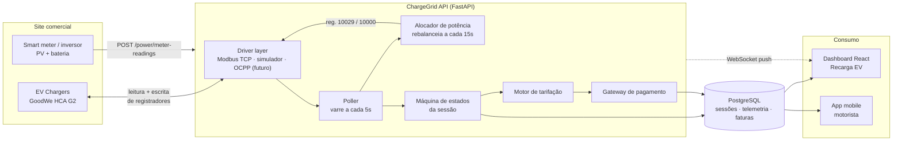

# ChargeGrid Intelligence — Backend

API de orquestração de recarga EV para **estabelecimentos comerciais** (FIAP × GoodWe, EV Challenge 2026).

Serve os dois clientes do repositório com o mesmo domínio: o **dashboard comercial**
(`apps/dashboard`, React + Vite, seção Recarga EV) e o **app do motorista**
(`apps/mobile`, React Native + Expo). Ambos consomem a API pelo `@chargegrid/sdk`
(`packages/sdk`), cujos tipos são gerados do `openapi.json` deste diretório.

> **O contrato é o acoplamento.** Mudou um schema? Regenere o `openapi.json`, rode
> `npm run gen:types` e `npm run typecheck` na raiz: a quebra aparece no build dos dois
> clientes, não na tela do usuário. Como tudo vive no mesmo repositório, a mudança do
> backend e a adaptação dos clientes cabem num commit só.

**Stack:** Python 3.11+ · FastAPI · SQLAlchemy 2 (async) · PostgreSQL 18 · Alembic · pymodbus

---

## O problema que este backend resolve

O desafio aponta três lacunas nos eletropostos comerciais de hoje — e a linha HCA G2
confirma cada uma:

| Lacuna | Situação no hardware | O que o backend faz |
|---|---|---|
| **Gerenciar potência** | O ponto só protege o próprio disjuntor (reg. 10025). Não existe visão de site. | Orçamento por site e rateio entre pontos, escrito no reg. 10029 |
| **Registrar o ciclo** | O SEMS+ não tem API de EV Charger; os dados só existem por consulta manual | Poller Modbus → máquina de estados → sessão persistida e auditável |
| **Tarifar e cobrar** | Sem OCPP, a linha HCA não cobra. Não há modelo de billing | Motor de tarifação por janela + faturas + gateway plugável |

---

## Arquitetura (data flow)



**O ponto central:** o SEMS+ só responde a consulta (*pull*) e não empurra dados. O poller
transforma varredura periódica em operação de tempo real, e o WebSocket entrega isso ao
navegador sem F5.

---

## Subindo em 1 comando

Na raiz do repositorio:

```bash
cp apps/api/.env.example apps/api/.env
# Preencha os valores de apps/api/.env antes de continuar.
npm run infra:up
```

O atalho executa `docker compose --env-file apps/api/.env up --build -d`.
O Compose fica na raiz e o Dockerfile permanece nesta aplicacao.

Sobe Postgres, aplica as migrations, popula o cenário-base e serve a API:

- API: http://localhost:8000
- Swagger: http://localhost:8000/docs
- Health: http://localhost:8000/health

### Sem Docker

Execute os comandos abaixo em `apps/api/`.

```bash
python -m venv .venv && source .venv/bin/activate   # Windows: .venv\Scripts\activate
pip install -e ".[dev]"
cp .env.example .env                                 # ajuste POSTGRES_*
alembic upgrade head
python -m app.seed
uvicorn app.main:app --reload
```

### Credenciais criadas pelo seed

| Perfil | E-mail | Senha |
|---|---|---|
| Admin | `admin@chargegrid.com.br` | valor de `SEED_ADMIN_PASSWORD` |
| Operador | `operador@chargegrid.com.br` | valor de `SEED_OPERATOR_PASSWORD` |
| Motorista | `joao.silva@email.com` (e os demais do mock) | valor de `SEED_DRIVER_PASSWORD` |

> `CHARGER_DRIVER=simulator` (padrão) roda tudo **sem hardware** — o simulador respeita
> teto de potência, curva de carga e ociosidade. Para falar com o eletroposto real,
> use `CHARGER_DRIVER=modbus` e cadastre `host`/`port`/`unit_id` do ponto.

---

## Testes

```bash
pytest -q          # 757 testes
ruff check app     # lint
```

| Arquivo | O que protege |
|---|---|
| `test_power_allocation.py` | rateio por prioridade — nunca estourar o orçamento do site |
| `test_beneficio_na_tarifa.py` | a ordem em que desconto, franquia e mínimo entram na conta |
| `test_campanhas.py` | elegibilidade e contagem: quem paga, por quanto tempo, sobre quais sessões |
| `test_recompensas.py` | que ninguém seja pago duas vezes, com teste de corrida no banco |
| `test_assinatura_motorista.py` | o encontro de plano e campanha: o melhor de cada, nunca a soma |
| `test_assinatura_plataforma.py` | multa, prazo mínimo e a cobrança que não sai duas vezes |
| `test_previsao.py` | que nenhum número de previsão saia sem a sua incerteza |
| `test_seed_historico.py` | que o histórico gerado seja fisicamente possível |
| `test_rotulos_do_recibo.py` | que o recibo não imprima nomes de coluna |
| `test_session_lifecycle.py` | máquina de estados: fila, telemetria, ociosidade, encerramento |
| `test_billing.py` | idempotência da fatura, linhas, mínimo, taxa do adquirente |
| `test_payments.py` | carteira, idempotência da cobrança, liquidação por meio |
| `test_tariff_engine.py` · `test_tariff_rules.py` | preço por janela vigente e coerência da tarifa |
| `test_virtual_meter.py` | curvas do medidor sintético |
| `test_charge_point_by_code.py` | resolução do código lido no QR: espaços, caixa e ponto desativado |
| `test_http_autorizacao.py` | quem entra em cada rota — pela porta da frente, com token de verdade |
| `test_http_app_motorista.py` | fluxos do app por HTTP: escopo por usuário, validação e serialização |
| `test_http_carteira.py` | crédito na carteira: idempotência, razão e recusa de valor inválido |
| `test_razao_da_carteira.py` | que o razão **feche com o saldo** depois de crédito e débito |
| `test_assinatura_plataforma.py` | prazo mínimo, multa, e o ciclo da inadimplência do contrato |
| `test_http_consultas.py` | custo de consulta do mapa de estações — trava o N+1 |
| `test_http_paginacao.py` | teto e paginação das listas |
| `test_http_telemetria.py` | reamostragem da série — cobre a janela sem truncar |
| `test_http_veiculos.py` | editar e remover carro, sem levar o histórico junto |
| `test_http_webhook_refresh.py` | assinatura HMAC do webhook e renovação de sessão |
| `test_sessao_por_motorista.py` | uma vaga por motorista de cada vez |
| `test_http_isolamento.py` | fatura e sessão entre motoristas e entre estabelecimentos |
| `test_falhas_terminais.py` | qual bit encerra a recarga e qual é só alarme |
| `test_corte_do_operador.py` | o corte manual do dashboard não é desfeito por sessão nova |
| `test_idempotencia_cobranca.py` | o contrato de chave que o dashboard usa para retentar |
| `test_indices_sessao_ativa.py` | as duas guardas de sessão ativa, no nível do banco |
| `test_achados_de_revisao.py` | os oito achados restantes da revisão, um bloco cada |
| `test_correcoes_da_revisao.py` | defeitos que as próprias correções introduziram |
| `test_fonte_de_dominios.py` | endereços saem de `config/domains.json`, não do código |
| `test_demanda.py` | previsão de estouro e custo evitado — a conta que vira dinheiro |
| `test_contrato_e_manutencao.py` | qual demanda contratar, e qual ponto vai quebrar |
| `test_utilizacao.py` | ocupacao e receita por ponto — o denominador honesto |
| `test_regras_de_prioridade.py` | quem carrega quando falta potencia, e por que |
| `test_multi_site.py` | admin escolhe a praca; operador nunca sai da dele |
| `test_limites_e_horario.py` | o teto que o motorista pede, e quando compensa começar |
| `test_push_e_recibo.py` | o que vibra no bolso, e o documento que vai para o contador |
| `test_reportes_e_frota.py` | o defeito que o sensor nao ve, e o rateio por centro de custo |
| `test_cobertura_de_schema.py` | campo que o modelo tem e a resposta descarta em silêncio |
| `test_config_guard.py` | recusa subir em produção com segredo público |

Os quatro `test_http_*` sobem a aplicação inteira sobre a mesma transação do
teste e falam HTTP. Existem porque todo o resto chama serviço ou handler direto,
o que pula a resolução do token, a guarda de papel e a validação do corpo — foi
assim que as rotas `/app/*` ficaram sem guarda de motorista sem ninguém notar.

> **O seed constrói o schema pelas migrations, não por `create_all`.** O que
> existe só na migration — os BRIN das séries temporais, os índices compostos e
> os únicos parciais — some de um banco montado a partir dos modelos. Era assim
> até 30/08/2026, e `alembic check` não acusava: ele compara modelos com
> migrations, e esses índices não estavam nos modelos. Agora estão.

**Os testes de serviço rodam contra um Postgres de verdade**, num banco `<db>_test` criado e
migrado automaticamente na primeira execução. Não é preciosismo: os modelos usam tipos que só
existem no Postgres e o código das sessões vem de uma `SEQUENCE` criada pela migration — um
SQLite fingindo ser Postgres passaria em testes que a produção reprovaria.

Cada teste roda dentro de uma transação desfeita no fim, então nada sobra no banco e a ordem
de execução não importa. O `conftest.py` explica os detalhes.

Com a API no ar, o teste de fumaça percorre o produto inteiro — login, orçamento, sessão,
fila de espera, agendamento, cobrança Pix, carteira, missões, campanhas, assinatura, contrato
da plataforma e previsão — em **117 cenários**:

```bash
python -m scripts.smoke_test                  # usa http://127.0.0.1:8000
python -m scripts.smoke_test http://host:porta
```

É a única camada que exercita HTTP, serviço, banco e worker **juntos**, com o seed real por
baixo, e por isso ela enxerga o que nenhum teste de unidade enxerga: recompensa concedida sem
o dinheiro correspondente na carteira, multa que o servidor calcula de um jeito e o painel de
outro, rota de dinheiro aberta para quem não devia.

Toda seção é **re-executável** — o que cria, encerra; o que assina, cancela; o que gasta,
recarrega antes. Não é cortesia: um smoke que só passa na primeira rodada falha na segunda e
ensina todo mundo a ignorar falha. A exceção documentada é a campanha, porque `DELETE` ali
significa *encerrar* e não *apagar*: cada rodada deixa uma campanha inativa chamada
`Smoke (pode apagar) …`.

---

## O que roda sem ninguém clicar

Estes laços são o que transforma consulta periódica em operação de tempo real. Rodam no servidor,
independem do dashboard estar aberto, e são a razão de a tela mudar sozinha.

| Rotina | Cadência | O que faz |
|---|---|---|
| poller | 5 s | Varre todos os pontos em paralelo, grava telemetria, avança a máquina de estados e publica no WebSocket |
| rebalanceador | 15 s | Recalcula o orçamento e escreve os novos tetos nos eletropostos |
| promoção da fila | 15 s | Energiza quem espera, na ordem, enquanto o orçamento comportar |
| expiração de agendamento | 5 s | Reserva não usada devolve a potência ao rateio |
| sincronização de reserva | 5 s | Escreve nos regs 10020-10022 a reserva que entrou na janela de 24 h e apaga a que foi cancelada, consumida ou expirou |
| expiração da fila | 5 s | Sessão que esperou demais libera o eletroposto |
| marcação offline | 90 s | Ponto sem leitura recente vira `offline` — não pode aparecer saudável no dashboard |

Com mais de uma réplica, deixe os workers em **uma só** (`ENABLE_WORKERS=false` nas demais): dois
pollers escrevendo no mesmo eletroposto brigam pelo registrador 10029.

## Autenticação

O dashboard e o app usam o mesmo emissor. Papéis: `admin` e `operator` acessam o dashboard comercial,
`driver` só o escopo do app — um motorista recebe **403** em qualquer rota de gestão.

| Endpoint | Uso |
|---|---|
| `POST /auth/login` | Devolve o par access (1 h) + refresh (30 dias) |
| `POST /auth/refresh` | Renova o access sem novo login |
| `POST /auth/register` | Cadastro público do app — sempre cria `driver` |
| `GET /auth/me` | Perfil e papel do usuário autenticado |

O escopo do site vem do token: um operador nunca enxerga outro estabelecimento.

### Contas de operação (`/users`)

Operador e admin só nasciam do seed ou de um `INSERT` — e a docstring de `/auth/register` chegou
a apontar para uma rota `/users` que **nunca existiu**. Agora existe, e é de admin.

| Endpoint | Uso |
|---|---|
| `GET /users` | Operadores e admins, com a praça de cada um. Traz os desligados |
| `POST /users` | Cria operador (exige `site_id`) ou admin |
| `PATCH /users/{id}` | Liga ou desliga o acesso |

**Operador exige praça, e a guarda é de segurança, não de formulário.** `get_scoped_site_id`
devolve o *primeiro site cadastrado* para quem não tem `site_id`: um operador criado sem praça
não ficaria sem acesso — ficaria com o acesso da praça de outra pessoa, sem nada na tela dele
indicando isso.

**Motorista não aparece.** Ele se cadastra sozinho pelo app, e são milhares. Misturar os dois
faria "desligar" significar também "bloquear cliente", que é outra decisão. Bloquear motorista
abusivo segue sem caminho — limite declarado, não esquecimento.

**Não há apagar.** As FKs de auditoria e faturamento são `SET NULL`: apagar a conta apagaria o
vínculo do rastro dela. Desligar tira o acesso e preserva quem fez o quê. E **ninguém desliga a
própria conta** — a saída seria um `UPDATE` no banco, que é o estado do qual esta rota veio tirar
o projeto.

Uma guarda de "último admin ativo" chegou a ser escrita e foi **removida por ser inalcançável**:
quem chama é um admin ativo, então desligar outro sempre deixa o solicitante de pé, e desligar a
si mesmo esbarra na guarda acima antes.

## Os módulos

Os três primeiros são a operação: o que acontece agora. Os três últimos são a decisão: o que
fazer com o que já aconteceu — e é neles que o painel deixa de relatar e passa a recomendar.


### 1. Gerenciamento de Potência

O orçamento é recalculado a cada ciclo, porque PV, bateria e carga do prédio mudam o dia inteiro:

```
orçamento_ev = limite_da_rede + PV + bateria − max(reserva_predial, consumo_real_do_prédio)
```

A distribuição usa **water-filling por faixa de prioridade**: dentro de uma faixa todos recebem
parcela igual, e quem satura devolve a sobra para os demais. Um ponto que não alcança a potência
mínima do hardware (1,4 kW mono / 4,2 kW trifásico) é **suspenso** em vez de receber uma migalha —
manter três carros em 1 kW não carrega nenhum deles.

O resultado vira escrita no reg. **10029** (`Maximum Charging Power`). Para corte imediato sem
derrubar sessões, o reg. **10000** (`EMS Energy Dispatch`) força o ponto ao mínimo.

Dois tetos, não um: `rated_kw` é o limite físico do equipamento e `operator_max_kw` é a política
que o operador define no dashboard. O rateio distribui a potência disponível mas **nunca sobe acima
da política** — sem essa separação, o ciclo automático devolveria o ponto ao nominal 15 segundos
depois de o operador ajustar o slider, e o controle do dashboard não controlaria nada. Vale o mesmo
para `operator_throttled`: um corte manual sobrevive ao poller e ao rateio até o operador liberar.

**"Potência alocada" conta só quem pode puxar.** O número que o dashboard compara com o disponível
soma o teto dos pontos despacháveis — carregando ou suspensos —, não de todos. Somar o limite de
pontos ociosos, na fila ou cortados inflava o total com tetos que ninguém está usando e acendia um
alerta de *excede a disponibilidade* com o site inteiro tranquilo.

**Agendamentos entram na conta.** Uma reserva com janela em curso sai do orçamento (`booked_kw`)
e volta assim que a sessão começa — se continuasse segurando durante a própria recarga que
reservou, a capacidade seria contada duas vezes. Quem não aparece até o fim da janela expira e
devolve a potência sozinho.

**Quem já carrega tem precedência.** Quando não cabe todo mundo, a ordem de corte tira primeiro
quem está chegando — que é quem pode esperar na fila. Sem essa regra, um recém-chegado derrubava
um cliente no meio da recarga.

| Endpoint | Uso |
|---|---|
| `GET /power/overview` | Tudo da tela em uma chamada (orçamento, KPIs, pontos) |
| `GET /power/plan` | Prévia do rateio, sem tocar no hardware |
| `POST /power/rebalance` | Botão "Redistribuir agora" (`?dry_run=true` simula) |
| `POST /power/charge-points/{id}/limit` | Slider de limite por ponto |
| `POST /power/charge-points/{id}/throttle` | Corte de emergência (reg. 10000) |
| `GET /power/budget` · `PATCH /power/budget` | Lê e ajusta limite de rede, reserva, PV/bateria e SOC mínimo |
| `GET /power/charge-points` · `POST` · `PATCH /{id}` | Cadastro e configuração dos pontos |
| `POST /power/meter-readings` | Entrada do smart meter / inversor GoodWe |
| `GET /power/demand/forecast` | Projeta a demanda das próximas horas contra o contrato |
| `GET /power/demand/avoided-cost` | Quanto o rateio poupou de ultrapassagem no período |
| `GET /power/demand/contract-simulator` | Qual demanda contratar, dado o consumo medido |
| `GET /power/maintenance/attention` | Pontos que vêm falhando com frequência |
| `GET /power/utilization/by-point` | Ocupação, receita e ociosidade de cada ponto |
| `GET /power/priority-rules` · `POST` · `PUT /{id}` · `DELETE /{id}` | Regras de prioridade nomeadas |
| `GET /power/priority-rules/preview` | Qual regra pegaria cada ponto, no horário informado |
| `GET /power/sites` | Praças que o usuário pode escolher (operador vê só a própria) |
| `GET /power/sites/portfolio` | As praças lado a lado — só admin |

### 2. Ciclo da Sessão

```
AUTHORIZING → STARTING → CHARGING → FINISHING → FINISHED → BILLED
     ↓            ↑           ↓
   QUEUED ────────┘        SUSPENDED  (corte do controle de demanda)
```

**QUEUED** é a fila de espera. Sem folga no site, a sessão entra nela em vez de falhar, e o
rebalanceador a promove quando o orçamento abre — ordem por prioridade do ponto e, dentro da mesma
faixa, por chegada. Quem já está carregando nunca é cortado para dar lugar a um recém-chegado: é o
novato que espera. Passado `QUEUE_TIMEOUT_MINUTES` (30 por padrão) a sessão sai da fila e libera o
eletroposto. Quem prefere falhar na hora envia `queue_if_unavailable: false`.

Toda transição grava um `SessionEvent` — é exatamente o que a timeline do dashboard renderiza.
Transição inválida levanta erro de domínio; o banco ainda garante, por índice parcial único,
que **um ponto não tem duas sessões ativas** (dois requests simultâneos passam pela mesma checagem
em memória, mas não pelo índice).

Duas coisas que costumam ficar de fora e aqui não ficam:

- **Sessão iniciada localmente** (RFID ou plug-and-charge) é **adotada** pelo poller e vira sessão
  faturável. Sem isso, energia sai do medidor sem cobrança associada.
- **Parada automática** por limite de kWh, minutos, valor ou pré-autorização esgotada.

| Endpoint | Uso |
|---|---|
| `GET /sessions` · `GET /sessions/kpis` | Lista filtrável e cartões do topo |
| `GET /sessions/{id}` | Detalhe com a linha do tempo do ciclo |
| `POST /sessions` | Autoriza e inicia. Sem folga, entra na fila — `queue_if_unavailable: false` falha na hora |
| `POST /sessions/{id}/stop` | Encerrar sessão (fatura por padrão) |
| `GET /sessions/{id}/preview` | Quanto já custa agora, rateado por janela |
| `GET /sessions/{id}/telemetry` | Série de potência/energia para o gráfico, com o teto aplicado |
| `POST /sessions/{id}/bill` | Fatura manualmente uma sessão encerrada (idempotente) |

### 3. Tarifação & Pagamento

Uma sessão das 17h40 às 19h20 atravessa a fronteira ponta / fora-de-ponta. O motor **rateia
energia e tempo sobre as amostras de telemetria**, atribuindo cada pedaço à janela vigente
naquele instante — não é kWh × preço único. Toda a aritmética é `Decimal`.

Componentes: R$/kWh, R$/min, ociosidade (com tolerância configurável), taxa de conexão,
minutos livres, valor mínimo e **multiplicador dinâmico** — o gancho para a IA de previsão de pico.

O **tipo declarado restringe** os componentes (`app/services/tariff_rules.py`): uma tarifa marcada
"por tempo" com preço por kWh é recusada com 422. Sem essa regra o campo mentia — o operador
escolhia um modelo de cobrança e a fatura aplicava outro.

**Cobertura das janelas precisa fechar a semana.** Se algum instante não casar com nenhuma janela,
a cobrança cai no preço base em silêncio.

A fatura guarda um **snapshot da tarifa aplicada**: mudar o preço amanhã não reescreve a cobrança
de ontem. A taxa do adquirente é separada, então o lojista vê receita bruta e líquida.

| Endpoint | Uso |
|---|---|
| `GET/POST/PATCH /tariffs` · `PUT /tariffs/{id}/windows` | Políticas e janelas horárias |
| `DELETE /tariffs/{id}` | Exclui tarifa nunca usada; recusa com 409 se há histórico |
| `POST /tariffs/simulate` | Simulador de custo da tela |
| `GET/PUT /payment-methods` | Métodos aceitos e taxas |
| `GET /invoices` · `GET /invoices/{id}` | Faturas geradas das sessões |
| `POST /invoices/{id}/charge` | Dispara a cobrança (idempotente) |
| `POST /invoices/{id}/refund` | Estorna a fatura — carteira volta na hora, PSP pelo provedor (admin) |
| `POST /wallets/{id}/adjust` | Correção manual de saldo, com motivo e responsável (admin) |
| `POST /payments/webhook` | Liquidação do PSP, com HMAC obrigatório |
| `GET /revenue/summary` | Receita bruta × líquida do período |

#### Estorno e ajuste: as duas origens que faltavam

`origem` aceitava `estorno` e `ajuste` desde a `0021` e **nada criava nenhum dos dois**. Dar
caminho a eles revelou um defeito de verdade: **pagamento por carteira era irreversível pela
API**. `handle_webhook` sabia marcar `REFUNDED` quando o PSP avisava, mas carteira não gera
webhook — é capturada na hora —, então uma recarga cobrada errado do saldo do motorista só se
desfazia no banco.

| operação | rota | quem | o que faz |
|---|---|---|---|
| **estorno** | `POST /invoices/{id}/refund` | admin | carteira → crédito no razão, na hora; PSP → chama `provider.refund` |
| **ajuste** | `POST /wallets/{id}/adjust` | admin | cria ou destrói saldo por decisão humana |

Admin nos dois, e não operador: devolver dinheiro é decisão da rede — o motorista não pode se
auto-reembolsar, e o operador não devolve do caixa da plataforma.

**Só o ajuste exige motivo**, e o CHECK `ajuste_com_motivo` o garante no banco. É o único
lançamento em que alguém *escolhe* o número: não há fatura nem recarga por trás. Saldo que
aparece na conta de alguém sem ninguém saber explicar é o defeito que um razão existe para
impedir. O estorno fica de fora da exigência porque a fatura **é** a justificativa — e o motivo
vai para o rótulo do extrato, não para um campo escondido.

`criado_por` grava **quem** decidiu, com `SET NULL`: a saída do funcionário não apaga o
lançamento, mas enquanto a conta existir o nome fica junto do dinheiro.

Ajuste aceita valor negativo de propósito — correção existe nos dois sentidos, e um crédito
lançado por engano precisa poder ser desfeito. O que não se aceita é deixar o saldo negativo: a
carteira é pré-paga, e saldo devedor seria crédito que ninguém autorizou.

**Um carimbo por linha, não por transação.** `created_at` de `wallet_entries` usa
`clock_timestamp()` (migration `0026`), e não o `now()` herdado do mixin. `now()` devolve o
instante em que a *transação* começou, e `conceder_pendentes` credita todas as recompensas
pendentes num commit só: um motorista que concluiu duas missões na mesma passada recebia duas
linhas com o mesmo carimbo, o extrato desempatava por `id` (UUID sorteado) e o saldo corrido
podia parecer andar para trás. As demais tabelas continuam com `now()`, que para elas é o
comportamento certo.

#### Pix: escrito e testado, não homologado

`PixProvider` fala a API Pix do BACEN — OAuth2 `client_credentials` sobre mTLS, `PUT /v2/cob/{txid}`,
`GET /v2/cob/{txid}`, `PUT /v2/pix/{e2eid}/devolucao/{id}`. Os 34 testes o exercitam contra um PSP
de mentira (`httpx.MockTransport`): caminho, cabeçalho, corpo, renovação de token, erro em RFC 7807
e a travessia completa do webhook até a fatura paga.

O que **não** existe é uma execução contra um PSP real — não há conta contratada. Trate como
integração escrita e testada, não homologada; o primeiro contato com um PSP de verdade vai achar
divergência de detalhe, porque sempre acha.

Três coisas da especificação que custam caro descobrir tarde:

| detalhe | por quê |
|---|---|
| `txid` é `[a-zA-Z0-9]{26,35}` | `INV-1042` tem hífen e oito caracteres — o PSP recusa. O nosso é derivado da fatura, **determinístico**, e começa pelo código dela para a conciliação manual continuar possível |
| `PUT /v2/cob/{txid}`, não `POST /v2/cob` | com txid próprio a chamada é idempotente por construção: o retry de uma resposta perdida reaproveita a cobrança em vez de abrir a segunda |
| valor é **string** com duas casas | `Decimal("10.1")` vira `"10.1"` e o PSP recusa; `float` chega a `"10.100000000000001"` |

O corpo do webhook do Pix é `{"pix": [...]}` — uma lista, sem campo de status, e **sem referência
no topo**. Por isso `provedor_do_evento` olha dentro de `pix[]` e `traduzir_webhook` desmonta a
lista: sem esses dois, o evento cai no provedor global, nunca é traduzido, e a fatura fica aberta
com o dinheiro já recebido.

Configuração em `SitePaymentMethod.provider_config`, por estabelecimento — o dinheiro cai direto no
lojista: `base_url`, `client_id`, `client_secret`, `chave_pix`, `certificado`, `chave_privada`,
`verify`, `expiracao_segundos`, `webhook_secret`.

**Uma ressalva de segurança que o código não resolve sozinho:** o Pix autentica o webhook por
**mTLS**, não por HMAC. Aqui o HMAC continua obrigatório porque é o que dá para verificar dentro da
aplicação; num deploy real, o proxy que termina o TLS precisa exigir e validar o certificado de
cliente do PSP. Sem isso, a autenticação do webhook vale o quanto vale o segredo compartilhado.

---

### 4. Demanda contratada

A tarifa do Grupo A cobra **demanda (kW)** à parte da energia (kWh), pela **maior média de 15
minutos do mês**. Um pico de quinze minutos, uma vez, define a conta inteira; ultrapassar o
contratado sai ao dobro, com 5% de tolerância (REN 1.000/2021). Por isso avisar antes vale mais
que relatar depois.

Três respostas: a **previsão** projeta as próximas horas contra o contrato; o **custo evitado**
mede quanto o rateio poupou de ultrapassagem no período; e o **simulador** varre as faixas de
contrato somando, para cada uma, o custo fixo mais a penalidade que aquela faixa teria gerado
sobre o histórico real medido.

O simulador tem uma guarda que vale mais que a conta: **abaixo de 96 janelas** de 15 minutos —
um dia cheio — a resposta vem com `confiavel: false` e o painel troca o destaque da economia por
um aviso. Recomendar demanda menor sem ter medido o suficiente para ter visto o pico do mês
custa ultrapassagem ao dobro, todo mês. O número continua sendo devolvido; o que a guarda faz é
não chamá-lo de conselho.

### 5. Ocupação e retorno

Onde colocar o próximo ponto, qual remover, e qual está ocupado sem faturar.

O denominador são horas **disponíveis**, não corridas: as janelas de falha terminal saem da
conta, com episódios sobrepostos mesclados — duas falhas simultâneas são um período parado, e
somá-las podia zerar as horas disponíveis de um ponto que funcionou o mês inteiro. Um ponto que
passou a semana em falha não é um ponto sem procura; é um ponto quebrado, e as duas situações
pedem ações opostas.

Ocupação alta também não é faturamento. Um carro que termina de carregar e fica plugado deixa o
ponto 90% ocupado faturando como 40%; `idle_minutes` separa os dois casos, e a tela rotula
**congestionado** (falta ponto) contra **bloqueado** (falta cobrar ociosidade). Sem a distinção,
o operador compra hardware para resolver um problema de política de preço.

A janela nunca é maior que a idade do site — a mais antiga entre o cadastro e a primeira sessão,
porque um site migrado tem histórico anterior à própria linha. Sem esse limite, um site
instalado há uma semana devolvia todos os pontos como *ociosos*: a conta cobrava deles 23 dias
em que não existiram.

### 5.1 Série diária (a leitura executiva)

Todo agregado acima responde **quanto** — total da janela. `GET /power/analytics/daily` responde
**para onde está indo**: sessões, energia e receita de cada dia. Duas quinzenas com a mesma
receita são negócios diferentes se uma sobe e a outra cai, e nenhuma outra rota mostrava isso.

Três decisões mudam o que o gráfico afirma, e nenhuma é cosmética:

- **dia parado vem com zero**, não omitido. `GROUP BY` só devolve dia com movimento, e desenhar
  apenas esses encosta segunda em quinta: a queda desaparece atrás de uma reta;
- **o agrupamento é no fuso do site**. Uma recarga das 22h em São Paulo cai no dia seguinte em
  UTC, e o perfil semanal inteiro sai torto;
- **a janela não passa da idade do site** — mesmo critério de Ocupação. Os dias anteriores à
  primeira sessão não são dias parados: não existiram. Vem `janela_completa: false`, e as médias
  usam o período real.

A receita é ancorada no dia da **sessão**, não no da emissão da fatura: cobrança emitida no dia 5
por recarga do dia 3 pertence ao dia 3. E recebido nunca se soma a a receber — somar os dois
chamaria de receita dinheiro que ainda pode não entrar.

### 6. Regras de prioridade e multi-site

`charge_points.priority` decide quem fica sem carregar quando falta potência — a decisão mais
consequente do rateio — e era um inteiro sem explicação. Uma regra dá nome ao número, diz a que
pontos se aplica (todos, uma lista de códigos, ou um tipo de conector) e permite que a
prioridade **mude com a hora**: a frota precisa sair carregada às 7h, mas de dia quem paga a
tarifa cheia é o visitante.

A janela que cruza a meia-noite é o caso comum, não a exceção. Com `inicio <= t <= fim` nenhum
horário satisfaz ao mesmo tempo ≥22h e ≤6h: a regra mais importante do site ficaria desligada
sem erro e sem log. A primeira regra na `ordem` vence, com desempate por id — sem ordem
explícita, duas regras conflitantes davam resultado dependente de como o banco devolveu as
linhas. Tudo resolvido na **hora local do site**; em UTC, "22h" começaria às 19h locais.

O plano de rateio devolve o nome da regra que definiu cada faixa, que é o que permite responder
*por que este ponto foi cortado e aquele não*.

**Multi-site** afrouxa deliberadamente o escopo: passa a existir um caminho em que `site_id` da
query decide qual site responde. A assimetria é o ponto — o **operador** sempre recebe o próprio
estabelecimento, com o parâmetro *ignorado, não rejeitado* (rejeitar com 403 confirmaria que o
id existe); o **admin** escolhe, e o id é conferido contra o banco, senão um uuid digitado
errado devolveria 200 vazio, indistinguível de uma praça sem movimento.

### 7. Campanhas e recompensas

Duas tabelas para duas perguntas diferentes: `campaigns` diz **onde vale e quem administra**,
`missions` diz **o que precisa acontecer**. Quem paga é outra coisa — segue o tipo de benefício,
como o parágrafo abaixo explica.

Uma campanha declara **um único** `beneficio_tipo`, garantido por check constraint. Nunca "20%
de desconto E 5% de cashback" — é o caminho para ninguém conseguir dizer quanto a campanha
custou. E o bolso segue o mecanismo: **desconto** na fatura sai do estabelecimento, porque é a
margem dele naquela sessão; **cashback** na carteira sai da rede, porque crédito de carteira é
resgatável em qualquer site e um estabelecimento que o bancasse estaria financiando uma recarga
do concorrente ao lado. Inverter qualquer um dos dois produz um modelo invendável. `mission_progress` é **materializado**, e não derivado por consulta —
não porque derivar seria caro, mas porque um valor derivado não tem *instante*: a recompensa
precisa de um "quando isto foi concluído" para ser paga uma única vez, e sem linha não há onde
pendurar o índice único que impede o crédito duplo. Também porque a regra pode mudar depois que
alguém cumpriu: derivado, subir o alvo de 5 para 6 retiraria uma conclusão que o app já
comemorou.

**Agregação síncrona, pagamento assíncrono.** O progresso é recalculado dentro do mesmo commit
que fecha a fatura — é agregação determinística da sessão que acabou de encerrar, sem I/O
externo, então ou os dois existem ou nenhum. A concessão da recompensa não: mexe em saldo e em
push, e uma falha lá não pode desfazer a fatura.

O valor gravado é **absoluto**, recalculado por consulta. Sai mais caro e paga por si em duas
coisas: `dias_distintos` não é somável, e reprocessar uma sessão não dobra a contagem.

O push da recompensa usa **outbox próprio** (`rewards.notified_at`), e não `session_events`.
Afrouxar `session_events.session_id` para nulável seria o caminho curto e destruiria uma
guarda: `enviar_pendentes` trata `session is None` como evento órfão a descartar. E
`IDADE_MAXIMA_MIN` **não se aplica** aqui — "venha buscar o carro" perde valor em 30 minutos,
"você ganhou R$ 12" não perde nunca.


#### Frota: elegibilidade, não patrocínio

**A decisão de escopo que faltava, resolvida.** `patrocinador = 'frota'` **saiu**; `fleet_id`
virou **elegibilidade**.

O motivo estava no próprio modelo, e a pergunta original o ignorava: **`patrocinador` nunca foi
quem paga.** O bolso é determinado pelo *tipo de benefício* — desconto sai do estabelecimento
(é a margem dele naquela sessão), cashback sai da rede (crédito só vale dentro da plataforma).
Não há um terceiro. `patrocinador` responde **onde** a campanha vale e quem a administra.

Então `'frota'` como patrocinador era um valor sem mecanismo atrás: o schema aceitava, a
validação recusava com 422 e a consulta de elegibilidade filtrava fora — inalcançável pelos três
lados. Mesma classe de defeito que `inadimplente` era antes da `0023`.

Fazer dele verdade exigiria dar bolso à frota: `fleet_invoices` com ciclo, cobrança e
inadimplência, como a plataforma tem. Seria inventar um modelo comercial que ninguém pediu, a
partir de um `billing_email` que é a única pista de que alguém pensou nisso.

O que sobrou é a parte que **não precisa de bolso nenhum**: campanha restrita aos motoristas de
uma frota, paga por quem sempre pagou. A coluna já existia; mudou o papel dela — de "quem
financia" para "para quem vale". Isso a torna combinável com os dois patrocinadores:

| combinação | quem paga | para quem vale |
|---|---|---|
| `rede` + `fleet_id` | a rede | só os motoristas daquela frota |
| `site` + `fleet_id` | o estabelecimento | só os da frota, só naquele site |
| `rede` sem `fleet_id` | a rede | todos |

A segunda linha era **proibida** pelo CHECK antigo: `patrocinador='frota'` exigia
`site_id IS NULL`, então uma praça não tinha como dirigir campanha à frota da empresa vizinha.

**A feature não tinha dado nenhum por trás.** Zero frotas, zero motoristas com frota, zero
veículos com centro de custo — com modelo, rotas (`/app/fleet/report`) e tela (`FleetScreen`)
existindo desde a `0013`. A aba do app abria vazia para todos. O seed agora cria uma frota com
**dois dos cinco** motoristas: dois e não cinco de propósito, porque é o que torna visível a
diferença entre campanha dirigida e campanha para todos. Conferido na API: o motorista da frota
vê 4 missões, o de fora vê 3.

No painel, o formulário de campanha tem o seletor **"Para quem vale"** — "Todos os motoristas"
ou uma frota. A lista vem de `GET /campaigns/fleets`, que devolve **só id e nome**: CNPJ e
e-mail de cobrança são dados comerciais de uma empresa que não é cliente do operador, e
preencher um `<option>` não precisa deles. A rota fica sob `/campaigns` porque é isso que ela
serve; uma `/fleets` de propósito geral prometeria administração de frota, que este painel não
faz.

`fleet_id` **não** entra na lista de campos editáveis do `PATCH`, pelo mesmo motivo que
`patrocinador` não entra: mudar a quem a campanha se aplica depois de alguém ter acumulado
progresso reescreveria a história.

E **um dos dois é gestor**. `require_fleet_manager` exige as duas coisas — `fleet_manager` *e*
`fleet_id` —, então pertencer à frota não basta para ver o consolidado: `maria.souza` abre o
relatório, `carlos.lima` toma 403 na mesma empresa. Com os dois marcados, o recorte de leitura
que `deps.py` descreve não apareceria em lugar nenhum.

### 8. Assinatura do motorista

O plano entrega desconto percentual, kWh inclusos e isenção da taxa de conexão, tudo pelo mesmo
`Beneficio` que as campanhas usam: `rate_session` continua puro e não sabe que assinatura
existe. **Não há isenção de ociosidade**, e a ausência é deliberada — essa taxa não é receita, é
o mecanismo que libera a vaga, e isentar o assinante transformaria o melhor cliente naquele que
mais trava o conector.

Cancelar interrompe a renovação, não o mês já pago: há `ativa_de` para "pode assinar de novo?"
e `vigente_de` para "esta recarga tem desconto?". Usar uma no lugar da outra produz cobrança
dupla ou benefício retirado de quem pagou.

A mensalidade vira uma `Invoice` sem `site_id` — é da rede, e atribuí-la a uma praça inflaria o
faturamento de um estabelecimento com dinheiro que ele não recebeu.

### 9. Assinatura da plataforma

Dinheiro na direção **oposta**: aqui o estabelecimento paga a GoodWe. Por isso
`platform_invoices` é tabela separada, e não mais um `kind` em `invoices` — os relatórios somam
`invoices` por site, e a mensalidade entraria como receita de recarga do próprio lojista que a
pagou.

`minimo_ate` **não avança na renovação automática**. A rescisão antecipada gera multa
proporcional às mensalidades que faltavam; passado o prazo, sair é livre.

O ciclo fecha: **`encerrar_vencidos`** leva a `encerrada` o contrato cujo aviso prévio terminou.
Antes, nada fazia essa transição — `rescindir` gravava `encerra_em` e o contrato ficava em
`em_aviso_previo` para sempre. O efeito não era cosmético: `vigente_do_site` filtra
`estado <> 'encerrada'` e `contratar` recusa quem já tem vigente, então **quem rescindia ficava
sem saída** — sem ser faturado, marcado como "Em aviso prévio" para sempre, e sem poder assinar
outro plano.

**Dívida não segura o encerramento.** O período de serviço acabou na data combinada, e prender o
cadastro aberto para cobrar seria usar o contrato como instrumento de cobrança. As cobranças
continuam existindo — a FK é `RESTRICT` justamente para o histórico não sumir junto.

E é por isso que `contrato_do_site` lê **`ultimo_do_site`**, não `vigente_do_site`: sem isso,
encerrar viraria um jeito de sumir com dívida da tela — o contrato encerrado devolveria
`contratado: false` e o que ficou em aberto sairia junto. As duas leituras respondem perguntas
diferentes e **não podem ser trocadas uma pela outra**: `ultimo_do_site` serve a tela,
`vigente_do_site` decide se cabe contratar. Trocar a segunda pela primeira faria um contrato
encerrado bloquear o próximo — de volta ao defeito.

O que **não** existe, e vale dizer: nenhuma regra impede um devedor de assinar de novo. Isso é
política comercial, e inventá-la aqui seria decidir sozinho uma coisa que não é técnica.

**Um limite conhecido**, verificado na stack e registrado em vez de descoberto depois: quando a
praça contrata um plano novo, `ultimo_do_site` passa a devolver o contrato vigente, e as
cobranças do contrato anterior saem da tela — inclusive as em aberto. Mostrá-las misturadas com
as do contrato novo seria pior (são contratos diferentes, com competências próprias); o certo é
uma visão de histórico de contratos, que não existe. Enquanto não existir, o dado continua no
banco e acessível por `platform_invoices`, só não tem tela.

**A decisão de escopo, resolvida.** Não há liquidação bancária B2B, e isso é escolha declarada,
não lacuna: cobrar o estabelecimento por Pix exigiria credencial de PSP **da plataforma** — a
chave da GoodWe, não a do lojista, que é o que `SitePaymentMethod` guarda. Essa conta não
existe, e `liquidacao_automatica: false` na resposta continua dizendo a verdade. A baixa é
manual e de **admin**, porque deixar o próprio devedor declarar que pagou não seria baixa
manual.

O que foi construído no lugar é o **ciclo**, que não depende de banco nenhum:

| passo | o que acontece |
|---|---|
| passou de `vence_em` | a cobrança vira `vencida` — o dia do vencimento é do devedor, vence no seguinte |
| há cobrança vencida | o contrato vira `inadimplente` na mesma passada do worker |
| contrato inadimplente | **para de renovar sozinho** — `renovar_vencidos` só olha `ativa` |
| última dívida quitada | a baixa devolve o contrato para `ativa` |

Isso existe porque as duas pontas eram decorativas: `vence_em` era escrita desde a migration
`0019` e **nunca lida**, e `inadimplente` estava no CHECK e no badge vermelho do painel sem que
nada no sistema jamais o atribuísse. Uma dívida de três meses era indistinguível de uma cobrança
emitida ontem.

**O que deliberadamente não acontece: o serviço não é cortado.** Quem deixou de pagar foi o
estabelecimento; quem ficaria sem recarregar seria o motorista, que não tem nada com isso. Há um
teste (`test_o_servico_nao_e_cortado`) cuja única função é garantir que ligar o corte seja uma
decisão deliberada, e não algo que entre de carona.

`em_aviso_previo` não vira `inadimplente`: quem já pediu rescisão está de saída, o desfecho não
muda, e sobrescrever o estado apagaria a data em que o contrato acaba.

### Trilha de auditoria

`audit_logs` existia desde a migration `0001` — ator, ação, entidade, antes, depois, IP — e
**nada nunca gravou uma linha**. Tabela de auditoria vazia é pior que nenhuma: dá a impressão de
que há rastro, e a pergunta só aparece no dia em que alguém precisa dele.

**O que entra:** ação de *pessoa* que move dinheiro ou muda quem pode o quê.

| ação | rota |
|---|---|
| `carteira.ajustada` | `POST /wallets/{id}/adjust` |
| `fatura.estornada` | `POST /invoices/{id}/refund` |
| `cobranca_da_plataforma.baixada` | `POST /platform/invoices/{id}/settle` |
| `contrato.criado` · `contrato.rescindido` | `POST /platform/contract` · `/terminate` |
| `campanha.criada` · `campanha.encerrada` | `POST /campaigns` · `DELETE /campaigns/{id}` |
| `metodo_de_pagamento.alterado` | `PUT /payment-methods` |
| `conta.criada` | `POST /users` |
| `conta.ativada` · `conta.desativada` | `PATCH /users/{id}` |

**O que não entra, de propósito:** o que o worker faz sozinho — cashback concedido, mensalidade
cobrada, cobrança vencida. São consequências de regra, não decisões de alguém; auditá-las
encheria a tabela de linhas sem ator, que é exatamente o que ela não serve para guardar (o rastro
delas já existe: log estruturado e linha própria no razão). Leitura também não: auditar consulta
transforma a tabela num log de acesso e afoga o que importa.

**Na rota, não no serviço.** Ator e IP só existem na borda HTTP, e o mesmo serviço é chamado pelo
worker — `_creditar` roda nos dois. Auditar por dentro gravaria linha sem responsável toda vez que
o worker passasse.

**Não vaza segredo.** `provider_config` carrega `client_secret` e `webhook_secret`; a máscara
desce recursivamente por dicionários e listas. Auditoria que vaza credencial trocaria um defeito
por outro pior — e é o caso que o `PUT /payment-methods` exercita, porque o segredo aparece no
*antes* ao alterar um método já configurado.

**Mesma transação do que auditou.** `registrar` não commita: ou a operação e o registro acontecem,
ou nenhum dos dois. Uma trilha que registra o que foi desfeito por rollback mente tanto quanto uma
que perde o registro do que aconteceu.

`GET /audit` lê a trilha — **admin**, porque ela diz quem mexeu em quê e de qual IP, e isso não é
assunto de operador de praça. Sem essa rota, o dado existiria no banco e a pergunta continuaria
dependendo de alguém com acesso a produção.

No painel é a aba **Auditoria**, que só aparece para admin. A tabela mostra o que *mudou* — o
par antes/depois casado por chave — e não o retrato de cada lado: quem audita quer a diferença.
O `***` que o servidor mascarou passa direto, porque esconder a máscara esconderia que ali
existia um segredo. Estornar uma fatura fica na linha dela, em **Tarifação & Pagamento**, e só
para admin e só em fatura paga.

### 10. Previsão de demanda

A API apenas **lê** `site_forecasts`. Quem escreve é `apps/forecast`, fora deste processo: um
`import lightgbm` que falhe não pode derrubar o rebalanceamento de potência junto.

Duas colunas respondem perguntas diferentes: `modelo_aplicavel` diz se o modelo **conhece** o
local, e `fonte` diz de onde veio o número que está em `kwh_previsto`. Isso produz três estados,
e o aviso muda em cada um — falta de histórico e modelo pior que a régua entregam o **mesmo
número** por motivos opostos, e juntá-los faria o operador achar que falta dado quando o que
falta é modelo melhor.

A faixa só é desenhada quando `fonte = 'modelo'`; o CHECK do banco também recusa banda em
média móvel. Nada disso é escondido — mesma tradição de `confiavel` em `demand_service` e
`so_humano` em `maintenance_service`.

## App mobile (`/api/v1/app/*`)

Dashboard e app compartilham domínio, serviços e banco — o que muda é o escopo: o motorista
só enxerga o que é dele.

### Encontrar e carregar

`GET /app/stations` (mapa com disponibilidade e preço, ordenado por distância) ·
`GET /app/stations/{site_id}/charge-points` (vagas da estação) ·
`GET /app/charge-points/by-code/{código}` (QR colado no carregador) ·
`POST /app/sessions` (iniciar) · `GET /app/sessions/active` ·
`GET /app/sessions/{id}/preview` (custo pelo mesmo motor que fatura) ·
`POST /app/sessions/{id}/stop` ·
`POST /app/reservations` (agendamento com checagem de conflito) ·
`GET /app/invoices` · `POST /app/wallet/topup` · `GET /app/wallet/statement`.

### Teto da recarga

`POST /app/sessions` aceita `limit_kwh`, `limit_minutes` e `limit_amount`. Quem os aplica é a
ingestão de telemetria: `reached_limit` encerra a sessão no primeiro que for atingido. A rota
só os registra.

**A pré-autorização também encerra a sessão.** Um teto de R$ 80 sobre a pré-autorização padrão
de R$ 50 nunca seria alcançado — a recarga pararia nos 50 e o motorista veria o próprio limite
ignorado, sem erro nenhum. A rota eleva a pré-autorização ao teto pedido: não dá para gastar
mais do que se autorizou.

### Quando começar

| Endpoint | Uso |
|---|---|
| `GET /app/charge-points/{id}/when-to-start` | Compara começar agora com o melhor horário à frente |

A conta caminha a sessão pelas janelas horárias com o mesmo `resolve_rates` que vai faturar
depois, em passos de 15 min — uma recarga longa atravessa a virada no meio, e o preço médio que
ela paga não é o de nenhuma das duas pontas. Comparar preço de tabela erraria justamente as
sessões que mais importam.

Economia irrelevante não vira conselho: são **duas** barreiras, R$ 1 **e** 5%. Cinco por cento
de R$ 3 continua sendo troco, e R$ 1 numa recarga de R$ 200 não paga a espera. Tarifa sem
janela devolve `disponivel: false` em vez de "o melhor horário é agora", que soaria como
análise sendo a ausência dela.

### Notificação push

| Endpoint | Uso |
|---|---|
| `POST /app/push-devices` | Registra (ou reaponta) o aparelho |
| `DELETE /app/push-devices/{token}` | Remove ao sair da conta |

O app fazia polling, o que cobre quem está com a tela aberta. O momento em que a notificação
importa é o outro: o motorista foi almoçar, a recarga terminou, e o conector fica ocupado
gerando taxa de ociosidade para ele e fila para os demais.

Os eventos já existiam em `session_events`; o que faltava era para onde mandar e o registro de
que já foi mandado. `session_events.notified_at` é um **outbox na própria tabela de eventos** —
o evento já é a fonte da verdade, e duplicar criaria duas histórias que podem divergir.

Notificáveis: recarga concluída, promovido na fila, encerrada por falha. A lista é curta de
propósito — notificar cada transição treina o motorista a ignorar, e aí a que importa também
passa despercebida.

**Só `finished`, nunca `billed`.** A máquina de estados permite apenas `finished → billed`,
então toda sessão faturada já passou por `finished` e já foi avisada. Aceitar os dois mandava
duas notificações com texto idêntico — energia e custo já estão fechados nas duas. Isso apareceu
no aparelho, não em teste: os testes usavam só `to_state=FINISHED` e nenhum reproduzia a
sequência inteira.

Três decisões que só aparecem quando algo dá errado:

- **falha no envio não marca nada.** Marcar transformaria "não entreguei" em "entreguei" e a
  notificação sumiria para sempre, sem erro visível em lugar nenhum.
- **evento com mais de 30 min não vira push.** "Venha buscar o carro" duas horas atrasado é
  pior que nada: o motorista já foi embora.
- **a migração 0012 marca todo o histórico como notificado.** Sem isso a primeira volta do
  worker num banco em uso dispararia dezenas de avisos sobre carros levados para casa dias atrás.

O envio roda em worker (`PUSH_INTERVAL_S`, padrão 20 s), não no momento da gravação: um serviço
de push lento travaria a transição de estado da sessão — o carro deixaria de ser liberado
porque a Expo caiu. Provedor plugável como o de pagamento; nome desconhecido estoura em vez de
cair no simulador.

`PUSH_PROVIDER` decide quem entrega: `log` registra sem enviar — exercita todo o caminho até a
borda e é o padrão para desenvolvimento — e `expo` entrega de verdade, exigindo FCM configurado
no projeto EAS. O procedimento está no [README do app](../mobile/README.md#fcm).

### Recibo da recarga

| Endpoint | Uso |
|---|---|
| `GET /app/invoices/{id}/receipt` | Dados do recibo, para a tela montar o resumo |
| `GET /app/invoices/{id}/receipt.html` | O documento, pronto para virar PDF no aparelho |

**A taxa do adquirente não entra.** `net_amount = total - processing_fee`: quem paga a taxa é o
estabelecimento, descontada do que recebe. O motorista pagou `total`, e mostrar a taxa no recibo
dele diria que pagou algo que não pagou — num documento que vai para prestação de contas, isso
é pior que incompleto.

O HTML é renderizado no servidor. Montá-lo no app faria os números dependerem da versão
instalada: dois motoristas com builds diferentes gerariam documentos diferentes para a mesma
fatura.

### Reportar problema no ponto

| Endpoint | Uso |
|---|---|
| `POST /app/charge-points/{id}/reports` | Reporta um problema visto no ponto |
| `GET /app/charge-points/{id}/reports` | Os reportes que **este** motorista fez ali |

Fecha o ciclo com a manutenção preditiva. `charge_point_faults` cobre o que o equipamento sabe
de si — bits de registrador. Não cobre cabo cortado, tela apagada, vaga tomada por um carro a
combustão nem adesivo de QR arrancado: nesses casos o ponto reporta "disponível" com toda a
sinceridade, porque do ponto de vista dele está tudo bem.

Por isso **dois reportes abertos sem nenhum sinal do sensor sobem o ponto para prioridade
alta**, com o rótulo `so_humano`. Se a manutenção esperasse o equipamento concordar, esperaria
por uma confirmação que nesses casos nunca vem.

Categorias fechadas, no schema e no banco. Campo livre sozinho vira depoimento, e depoimento não
agrega: três pessoas descrevendo o mesmo cabo rompido com palavras diferentes viram três
problemas num relatório que deveria mostrar um.

A lista de reportes de um ponto é informação do operador — o motorista só recupera os próprios.

**A fila agora drena.** O motorista reportava e **ninguém conseguia resolver**: `resolved_at`
era *lido* — a resposta do app expõe `resolvido`, e `ix_charge_point_reports_abertos` é a fila de
abertos — e nenhuma rota o escrevia. O CHECK `resolucao_completa` mantinha `resolved_by`
inalcançável junto.

| rota | o que faz |
|---|---|
| `GET /power/maintenance/reports` | os reportes da praça; `abertos=true` por padrão |
| `POST /power/maintenance/reports/{id}/resolve` | fecha, dizendo o que foi feito |

`/maintenance/attention` agrupa por categoria e diz **quantos** estão abertos; esta lista diz
**quais** — é dela que sai o trabalho de quem vai até o ponto.

**A descrição do que foi feito é obrigatória.** Fechar sem dizer transforma a fila num botão de
sumir com a reclamação: o próximo motorista que reportar o mesmo cabo não tem como saber que já
olharam, e o relatório de manutenção perde a única informação que o distingue de uma contagem de
reclamações.

**Fechar duas vezes não reescreve o primeiro fechamento.** Quem resolveu e quando são fato
consumado; a segunda chamada devolve o que já estava lá em vez de trocar o responsável pelo
último que clicou.

O escopo vem do **JOIN com o ponto**: `charge_point_reports` não tem `site_id`, e ler sem ele
devolveria a reclamação do vizinho. Reporte de outra praça responde **404**, e não 403 — dizer
"existe, mas não é seu" já entrega que ele existe.

**E quem reportou fica sabendo.** `ReportarProblema`, no app, lista os próprios reportes daquele
ponto com o desfecho — "Em análise" ou a resolução que o estabelecimento escreveu. Sem isso o
ciclo não fechava de verdade: a API devolvia `resolvido` desde sempre e nenhuma tela chamava
`myReports`, então o motorista mandava o problema e nunca ficava sabendo se alguém olhou.

A lista do operador traz o e-mail de quem reportou **e nada além dele**. O reporte já é uma reclamação;
enriquecer a linha com o resto do cadastro exporia o motorista a quem ele reclamou.

No painel, a fila fica na aba **Gerenciamento de potência**, abaixo da manutenção preditiva —
aquele card agrupa por categoria e diz *quantos* estão abertos, este diz *quais*. Fechar abre um
campo na própria linha, e o botão só habilita com descrição: o piso de 3 caracteres espelha o
`min_length` do `ResolucaoIn`, porque descobrir no 422 é a mesma informação chegando tarde. Ao
fechar, os dois cards são recarregados — sem isso o de cima continuaria dizendo "3 abertos" com
a fila já em 2.

### Missões e recompensas

`GET /app/missions` devolve as missões vigentes com o progresso **deste** motorista, filtrado
pelo `user.id` do token. A resposta não traz orçamento de campanha: expor isso vazaria a
estratégia comercial do estabelecimento para quem carrega nele.

Missões que ele ainda não começou aparecem com progresso zero — uma tela que só mostrasse
missão iniciada estaria vazia para quem acabou de instalar o app, que é exatamente quem mais
precisa ver o que há para ganhar.

### Plano de recarga

`GET /app/plans`, `POST /app/subscription` e `DELETE /app/subscription`. Saldo insuficiente
devolve **402**, e não 500: é condição esperada, e o app precisa distinguir "recarregue a
carteira" de "algo quebrou".

### Modo frota

| Endpoint | Uso |
|---|---|
| `GET /app/fleet/report?mes=AAAA-MM` | Relatório mensal por centro de custo |
| `GET /app/fleet/vehicles` | Carros da frota e suas áreas |
| `PUT /app/fleet/vehicles/{id}/cost-center` | Define a área de um carro |

Quem dirige não é quem paga. O centro de custo mora no **veículo**, não na pessoa: o carro
pertence a um departamento e roda com motoristas diferentes — amarrar na pessoa erraria toda vez
que alguém pega o carro de outra área, que é o caso comum.

`fleet_manager` é um recorte de **leitura** sobre o papel de motorista, não um papel novo.
Torná-lo `operator` lhe daria o painel de estabelecimentos onde a frota nem carrega; deixá-lo
motorista comum o cegaria para o gasto de todos.

O mês fecha pela **emissão da fatura**, não pelo início da recarga: uma sessão que começa 31/03
às 23h e termina 01/04 às 2h pertence à fatura de abril, e é a fatura que o financeiro concilia.
Fatura cancelada não entra — somaria dinheiro que ninguém pagou à conta de uma área. Carro sem
centro de custo **aparece** no relatório em vez de sumir num filtro: escondê-lo faria o total não
bater com a fatura, a pior forma de esconder um problema de cadastro.

O que o motorista vê é deliberadamente menor que a visão do operador: `StationPointOut` traz
código, conector, potência nominal e disponibilidade — limite de potência, registrador Modbus
e política do operador ficam de fora. Ele escolhe uma vaga, não opera o site.

Todas as rotas têm schema de resposta declarado: é o OpenAPI que gera os tipos do SDK, então
uma rota sem contrato deixaria o cliente sem tipo.

### Coluna nova exige uma decisão

`tests/test_cobertura_de_schema.py` não deixa uma coluna de modelo ficar de fora da resposta em
silêncio. Ou o schema a expõe, ou ela está declarada em `OMISSOES` com o motivo.

A regra existe porque o mesmo defeito apareceu **três vezes**: `AllocationOut` sem `regra`,
`SessionOut` sem os limites, `UserOut` sem `fleet_manager`. Nos três o modelo tinha o campo, o
serviço preenchia, e o Pydantic o descartava na serialização — sem erro, sem log, sem aviso.
Todos foram achados porque um teste de camada HTTP falhou por outro motivo.

Não é "expor tudo": várias omissões são deliberadas (`site_id` sai porque o escopo vem do token)
e algumas são obrigatórias (`hashed_password`, `provider_config`, `raw_response`). É que o
silêncio deixa de ser opção. Escrever a tabela já achou o quarto caso — `InvoiceOut` trazia
`subtotal` e `total` mas não `discount`, e numa tela que mostra os dois os números não fechavam.

Há guardas nos dois sentidos: justificativa órfã (coluna que sumiu ou passou a ser exposta) e
nome sensível aparecendo numa resposta.

---

## Integração com o hardware

`app/drivers/modbus_map.py` é a **fonte única de verdade** dos registradores, transcrita de
`docs/references/goodwe/hca-g2-modbus-map.md` (protocolo V1.0.15). Nenhum endereço mágico espalhado pelo código.

Principais registradores em uso:

| Reg. | Função | Uso aqui |
|---|---|---|
| `10000` | EMS Energy Dispatch | Corte imediato para potência mínima |
| `10001–10008` | Bytes de falha/alarme | Decodificados bit a bit em texto legível |
| `10015 / 10016` | Potência e energia da sessão | Telemetria e tarifação |
| `10017` | Status do ponto | Mapeado para o estado de negócio |
| `10025` | Controle dinâmico de carga | Mantido **ligado** como rede de segurança local |
| `10029` | Máxima potência de carga | **Escrita central do controle de demanda** |
| `10060` | Liga/desliga carga | Início e fim de sessão |
| `10065 / 10170 / 10172` | Medidor | Lastro fiscal da cobrança |
| `10103` | Energia verde | Relatório de sustentabilidade |
| `10500 / 10507 / 10514` | Cartões RFID | Autorização local |

**Troca de protocolo sem reescrita:** todo o sistema fala com o eletroposto pela interface
`ChargePointDriver`. Quando a linha HCA ganhar OCPP 1.6J, é uma terceira implementação ao lado
de `ModbusChargePointDriver` e `SimulatedChargePointDriver` — nenhum serviço muda.

Toda escrita no hardware é registrada em `command_logs` (registrador, valor, latência, sucesso,
quem disparou) — perícia de falha em campo depende disso.

---

## Modelo de dados

35 tabelas. As de série temporal (`telemetry_samples`, `site_meter_readings`, `command_logs`,
`audit_logs`) recebem índice **BRIN** — ordens de grandeza menor que B-tree quando as linhas
já chegam ordenadas no tempo, que é o caso do poller.

```
sites ─┬─ charge_points ─┬─ charge_point_connections
       │                 ├─ telemetry_samples
       │                 ├─ charge_point_faults      (o que o sensor vê)
       │                 └─ charge_point_reports     (o que a pessoa vê)
       ├─ tariffs ─── tariff_windows
       ├─ site_payment_methods
       ├─ site_meter_readings
       ├─ priority_rules
       ├─ site_forecasts              (a API só lê; quem escreve é apps/forecast)
       ├─ site_subscriptions ── platform_invoices   (o site paga a GoodWe)
       └─ charging_sessions ─┬─ session_events
                             └─ invoices ─┬─ invoice_lines
                                          └─ payments
fleets ── users ─┬─ vehicles      (o centro de custo mora aqui)
                 ├─ rfid_cards
                 ├─ reservations
                 ├─ push_devices
                 ├─ wallet_entries           (razão: crédito E débito, com a origem)
                 ├─ driver_subscriptions ── driver_plans
                 └─ mission_progress ── missions ── campaigns
                          └─ rewards          (o "eu te devo", separado do progresso)
platform_plans ── site_subscriptions
```

`wallet_entries` é **razão, não log**: cada linha tem sinal, e a soma delas é o saldo.

    SUM(wallet_entries.amount) = users.wallet_balance

Ela se chamou `wallet_topups` e guardava só entrada — o débito mexia em `users.wallet_balance`
sem deixar linha. Metade de um razão responde metade da pergunta: o motorista via o saldo cair
e não havia o que conferir, e com o cashback das campanhas ele passou a ver o saldo **subir**
sozinho também. A migration `0021` reconstruiu o passado a partir de `payments` e abriu o razão
de cada motorista com o saldo herdado, que é o que faz a invariante valer para trás.

O sinal diz a direção e `origem` diz o motivo, e um CHECK impede que divirjam: um `cashback`
negativo passaria por qualquer validação em Python e só apareceria quando o saldo de alguém não
fechasse. `ajuste` é o único de sinal livre — correção de operador existe nos dois sentidos.

O dinheiro anda nas **duas direções**, e as tabelas refletem isso. Em `invoices` o motorista
paga o estabelecimento; em `platform_invoices` o estabelecimento paga a rede. Juntá-las seria
tentador e envenenaria todo relatório: `utilization_service` e `portfolio_service` somam
`invoices` por `site_id`, e a mensalidade da plataforma entraria como receita de recarga do
próprio lojista que a pagou.

`rewards` usa `RESTRICT` na campanha enquanto as demais usam `CASCADE`, e a divergência é
deliberada: recompensa é dinheiro concedido, e apagar a campanha não pode apagar o rastro de
quem já ganhou.

As duas fontes de defeito ficam **separadas de propósito**. `charge_point_faults` tem bit e
contagem de ciclos; `charge_point_reports` tem categoria e texto de gente. Forçar um formato no
outro perderia justamente o que cada uma sabe — e a manutenção preditiva lê as duas.

`charge_point_faults` guarda **episódios**, não estado: `charge_points.active_faults` é um
retrato que o poller sobrescreve a cada ciclo, e manutenção preditiva depende de recorrência.
Um índice único parcial garante um episódio aberto por ponto e rótulo — sem ele, o poller de 5
em 5 segundos transformaria um minuto de falha em doze episódios.

Dinheiro é `Numeric`, nunca `float`. Códigos legíveis (`SES-20483`, `INV-1042`, `RES-5007`)
vêm de sequências do Postgres.

---

## Onde a IA entra

O backend já produz o dado estruturado que os modelos precisam e expõe os pontos de escrita:

| Pilar | Insumo já gravado | Gancho de atuação |
|---|---|---|
| Previsão de pico | `site_meter_readings` + `telemetry_samples` | `Site.grid_limit_kw`, prioridade dos pontos |
| Precificação dinâmica | Folga de potência do rebalanceador (regra, **não** modelo) | `Site.bandeira_*` → `ChargingSession.multiplicador_travado` |
| Alocação inteligente | Curva real de cada ponto e sessão | `ChargePoint.priority` (o alocador respeita) |
| Detecção de anomalia | `command_logs` + falhas decodificadas | `ChargePointStatus.MAINTENANCE` |
| Previsão de energia | `charging_sessions` agregadas por dia e local | `site_forecasts` (leitura da API) |

O multiplicador dinâmico vem da **bandeira do site**: a cada ciclo o rebalanceador divide a
potência disponível pela capacidade (rede + solar + bateria) e grava verde (x1,00), amarela
(x1,15) ou vermelha (x1,30). A sessão trava o multiplicador ao iniciar, o motor de tarifação o
aplica e o snapshot da fatura registra a origem — o preço cobrado continua explicável, que é o
requisito para cobrança dinâmica em varejo. Liga por `PRECIFICACAO_DINAMICA=true`; desligada,
vale o `Tariff.dynamic_multiplier` digitado pelo operador, como antes.

A previsão de energia é o único pilar com **modelo treinado de verdade** hoje, e o resultado
honesto é que ele perde das réguas: 16,45% de WAPE mensal contra 16,04% da média móvel de 28
dias e 14,08% da média por dia da semana; no diário, 29,42% contra 28,79% da melhor régua
(`apps/forecast/modelos/metricas_atual.json`).

Por isso `site_forecasts.fonte` existe: o job grava o preditor que **mede melhor**, e a coluna
diz qual foi. Quando o modelo passar a ganhar, o backtest inverte a escolha sozinho.
`apps/forecast/README.md` detalha.

---

## O que cada tela do dashboard chama

O seed reproduz o cenário que o dashboard exibe — mesmos códigos de ponto, tarifas e perfis —,
então dá para conferir tela contra endpoint:

| Tela | Chamada |
|---|---|
| `PowerManagement.jsx` | `GET /api/v1/power/overview` → o payload já traz orçamento, KPIs e pontos |
| slider de limite | `POST /api/v1/power/charge-points/{id}/limit` |
| "Redistribuir agora" | `POST /api/v1/power/rebalance` |
| `SessionCycle.jsx` | `GET /api/v1/sessions` + `GET /api/v1/sessions/kpis` |
| detalhe / timeline | `GET /api/v1/sessions/{id}` (campo `events`) |
| "Encerrar sessão" | `POST /api/v1/sessions/{id}/stop` |
| `TariffPayment.jsx` | `GET /api/v1/tariffs`, `/payment-methods`, `/invoices` |
| simulador de custo | `POST /api/v1/tariffs/simulate` |
| `DemandContract.jsx` | `GET /power/demand/forecast`, `/avoided-cost`, `/contract-simulator`, `/energy-forecast` |
| `Campaigns.jsx` | `GET /campaigns`, `POST /campaigns`, `GET /campaigns/{id}/desempenho` |
| encerrar campanha | `DELETE /campaigns/{id}` (desativa; não apaga o progresso de ninguém) |
| `Contract.jsx` | `GET /platform/contract`, `/platform/plans` |
| rescindir | `POST /platform/contract/terminate` (devolve a multa antes de confirmar) |
| dar baixa | `POST /platform/invoices/{id}/settle` — **só admin** |
| `Utilization.jsx` | `GET /power/utilization/by-point` |
| `PriorityRules.jsx` | `GET /power/priority-rules` + `/preview`; grava por `POST`/`PUT`/`DELETE` |
| `Portfolio.jsx` | `GET /power/sites/portfolio` |
| seletor de praça | `GET /power/sites` — grava `siteId` no SDK, que anexa `site_id` a tudo |
| atualização ao vivo | `WS /api/v1/ws/site?token=<access_token>` |

Os valores de `status`, `state` e `payment` usam **as mesmas strings** dos componentes atuais
(`charging`, `available`, `faulted`, `finished`…), então os mapas `statusMeta`/`stateMeta`
continuam valendo.

---

## Configuração

> **Em produção, `CORS_ORIGINS` é obrigatória.** A imagem Docker é construída
> com contexto `./apps/api` — de propósito, para o backend fazer deploy sozinho
> sem arrastar `node_modules` —, então `config/domains.json` não existe dentro
> dela e o CORS cai no padrão de desenvolvimento. A aplicação **recusa subir**
> em `staging` ou `prod` com CORS só local: sem essa guarda ela subiria normal e
> o dashboard tomaria erro de CORS, que é dos sintomas mais difíceis de ligar à
> causa.


Tudo por ambiente (12-factor). Ver `.env.example`.

| Variável | Padrão | Nota |
|---|---|---|
| `CHARGER_DRIVER` | `simulator` | `modbus` para hardware real |
| `POLL_INTERVAL_S` | `5` | Varredura dos pontos |
| `POWER_REBALANCE_INTERVAL_S` | `15` | Ciclo do controle de demanda |
| `ENABLE_WORKERS` | `true` | Desligue em réplicas que só servem HTTP |
| `IDLE_GRACE_MINUTES` | `10` | Tolerância antes da taxa de ociosidade |
| `QUEUE_TIMEOUT_MINUTES` | `30` | Espera máxima na fila antes de liberar o ponto |
| `PAYMENT_PROVIDER` | `mock` | `mock` ou `pix` — um nome fora dessa lista impede o boot, de propósito |
| `SECRET_KEY` | — | **Obrigatória em staging/prod:** `openssl rand -hex 32` |

Rodando com várias réplicas: deixe os workers em **uma só** (`ENABLE_WORKERS=false` nas demais) —
dois pollers escrevendo no mesmo eletroposto brigam pelo reg. 10029. O barramento de eventos
em memória também vira Redis pub/sub nesse cenário; a interface `publish`/`subscribe` não muda.

---

## Segurança da configuração

Com `ENV=staging` ou `ENV=prod`, a aplicação **recusa subir** se algum segredo ainda for um valor
público do repositório — o padrão do código ou o placeholder do `.env.example`. A verificação
roda na inicialização e lista tudo que falta de uma vez:

```
Configuração insegura para ENV=prod:
  - SECRET_KEY é um valor público do repositório — qualquer pessoa com acesso a ele
    poderia assinar um token de administrador. Gere uma nova com: openssl rand -hex 32
  - PAYMENT_WEBHOOK_SECRET é um valor público do repositório — um webhook forjado
    marcaria faturas como pagas. Use o segredo que o PSP fornece.
  - DEBUG=true expõe stack trace ao cliente. Use DEBUG=false.
```

Cobre `SECRET_KEY` (incluindo comprimento mínimo de 32 caracteres), `PAYMENT_WEBHOOK_SECRET`,
`POSTGRES_PASSWORD` e `DEBUG`. Em `dev` nada muda — os padrões continuam valendo, sem atrito.

Documentar que "precisa trocar a chave" não impede ninguém de esquecer, e o esquecimento é
silencioso: a API subiria normal e assinaria JWT com uma chave publicada no repositório.

**As senhas do seed** criam usuários reais. Não existem no código: vêm de
`SEED_ADMIN_PASSWORD`, `SEED_OPERATOR_PASSWORD` e `SEED_DRIVER_PASSWORD`, e o seed
sorteia e imprime uma se a variável estiver vazia. São aceitáveis num
ambiente de avaliação; num ambiente exposto, não rode `python -m app.seed`. Na tela de login elas
aparecem como atalho apenas em desenvolvimento — ficam atrás de `import.meta.env.DEV` e não entram
no build de produção.

## Solução de problemas

**`ConnectionError: unexpected connection_lost()` ao conectar no Postgres (Windows)**

Use `POSTGRES_HOST=127.0.0.1`, nunca `localhost`. No Windows o `localhost` resolve para `::1`
(IPv6) antes do IPv4, o Docker Desktop publica a porta só no IPv4, e o `::1:5432` pode estar
ocupado por outro processo (`dllhost.exe`, por exemplo). O TCP abre, mas a conexão morre na
negociação SSL do asyncpg. O `.env.example` já vem com o IPv4 explícito.

Para conferir quem escuta na porta, a partir de `apps/api/`:

```bash
netstat -ano | grep 5432          # PIDs escutando
docker compose --env-file .env -f ../../compose.yaml ps                 # o contêiner está healthy?
```

**A API sobe mas os pontos ficam `offline`**

O poller precisa de um driver. Com `CHARGER_DRIVER=simulator` eles entram em `available` no
primeiro ciclo (5s). Com `CHARGER_DRIVER=modbus`, confira `host`/`port`/`unit_id` em
`charge_point_connections` e se o eletroposto responde na rede.

**Reiniciar a API não pega o código novo**

No Windows, `pkill` frequentemente não encerra o processo do uvicorn. Use:

```bash
PID=$(netstat -ano | grep -E "127.0.0.1:8000\s.*LISTENING" | awk '{print $NF}' | head -1)
taskkill //PID "$PID" //F
```

Sintoma clássico: o uvicorn novo falha com `[Errno 10048]` (porta em uso), morre em silêncio, e
o processo antigo continua servindo código velho.

**Banco em estado inconsistente**

Comandos a partir de `apps/api/`:

```bash
docker compose --env-file .env -f ../../compose.yaml down -v      # ⚠ apaga o volume
docker compose --env-file .env -f ../../compose.yaml up -d db
alembic upgrade head
python -m app.seed
```

---

## Notas de manutenção

**Nunca use `Base.metadata.create_all()` numa migration.** O metadata reflete os modelos
*atuais*, então a baseline passaria a criar colunas introduzidas por revisões posteriores e o
`upgrade head` quebraria num banco novo. A `0001` é DDL explícito e congelado.

**As sequências de código (`session_code_seq` e irmãs) são declaradas na mão na `0001`.** O
`--autogenerate` do Alembic não detecta `Sequence` solta no metadata. Sem elas, nenhuma sessão
pode ser criada.

**Índices em SQL cru estão protegidos em `alembic/env.py`.** Os BRIN e o unique parcial de sessão
ativa não existem no metadata; o filtro `include_object` impede que o próximo `--autogenerate`
proponha `drop_index` neles.

**Decisão do operador tem que persistir em campo próprio, nunca só no estado observado.**
`operator_max_kw` e `operator_throttled` existem por isso: o poller (5 s) e o rateio (15 s)
reescrevem `limit_kw` e `status` continuamente, então qualquer intenção guardada apenas nesses
campos é desfeita em segundos — e o controle do dashboard parece funcionar e reverte sozinho.

**Todo estado que bloqueia o ponto precisa de rota de saída.** `ACTIVE_SESSION_STATES` impede uma
segunda sessão no mesmo eletroposto; se algum desses estados não transiciona para `FINISHING` ou
`ERROR`, o ponto fica inutilizável sem recurso pela API. O teste
`test_autorizacao_pode_ser_cancelada` varre a tabela inteira de transições.

**Enum do backend que o front replica precisa ser revisado junto.** `ACTIVE_SESSION_STATES` tem uma
cópia em `src/views/ev/PowerManagement.jsx` para decidir o rótulo do botão de cada ponto. Quando
`QUEUED` entrou, a cópia ficou para trás e um ponto com motorista na fila mostrava *Iniciar* — um
botão que prometia algo que a API recusaria com 409.

**Mensagem de erro é texto de interface.** O `detail` das exceções aparece direto na tela quando
algo falha, então segue a mesma régua da UI: português correto, dizendo o que houve e o que fazer.

**Estado que ocupa o ponto não pode acumular consumo.** `AUTHORIZING` e `QUEUED` contam como
sessão ativa para bloquear o eletroposto, mas não energizaram nada — o poller precisa parar antes de
copiar os contadores, senão o motorista vê energia e custo de uma recarga que não aconteceu.

**Campo que promete algo tem que cumprir.** `Reservation.reserved_kw` era gravado e nunca lido
pelo rateio — agendar não segurava capacidade nenhuma. O laço agora fecha: a reserva sai do
orçamento enquanto a janela corre, é consumida quando a sessão começa (senão a mesma potência
seria contada duas vezes) e expira sozinha se ninguém aparecer. Mesma regra vale para
`Tariff.type`, que agora restringe os componentes de preço em vez de ser rótulo.

A mesma régua pegou `Reservation.pushed_to_hardware`, e desta vez o que faltava era o chamador.
Os registradores 10020-10022 estavam mapeados, `ModbusDriver.push_reservation` escrevia os três, o
simulador respondia e `COMMANDS` conhecia o nome — **e nada nunca chamou**: a coluna era `false` em
todas as linhas do banco. A reserva existia só no servidor, então quem chegasse com cartão na
frente do titular era atendido pelo equipamento. O laço fecha por **reconciliação**, e não por um
empurrão no `POST /app/reservations`, por três motivos: o reg 10021 guarda **hora:minuto, sem
data** — o equipamento tem relógio, não calendário, e empurrar hoje uma reserva de terça bloquearia
a vaga hoje naquele horário, por isso só entra o que começa dentro de 24 h; cancelar precisa
**retirar**, senão o ponto recusa todo mundo até a janela passar; e carregador que reinicia perde o
registrador, o que um empurrão único não tem como saber. A reserva continua valendo pelo servidor
mesmo quando a escrita falha — `pushed_to_hardware` responde "o equipamento também sabe?", e
`false` agora significa "vale só no software", não "ninguém nunca escreveu".

**A cobertura das janelas tarifárias precisa ser total.** Se algum instante da semana não casar
com nenhuma janela, a cobrança cai no preço base da tarifa em silêncio. O teste
`test_janelas_do_seed_cobrem_a_semana_inteira` varre os sete dias de 30 em 30 minutos.
