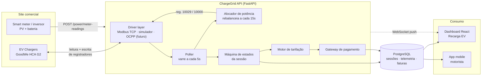

# ChargeGrid Intelligence — Backend

API de orquestração de recarga EV para **estabelecimentos comerciais** (FIAP × GoodWe, EV Challenge 2026).

Serve os dois clientes do repositório com o mesmo domínio: o **painel comercial**
(`packages/dashboard`, React + Vite, seção Recarga EV) e o **app do motorista**
(`packages/mobile`, React Native + Expo). Ambos consomem a API pelo `@chargegrid/sdk`
(`packages/sdk`), cujos tipos são gerados do `openapi.json` deste diretório.

> **O contrato é o acoplamento.** Mudou um schema? Regenere o `openapi.json`, rode
> `npm run gen:types` e `npm run typecheck` na raiz: a quebra aparece no build dos dois
> clientes, não na tela do usuário. Como tudo vive no mesmo repositório, a mudança do
> backend e a adaptação dos clientes cabem num commit só.

**Stack:** Python 3.11+ · FastAPI · SQLAlchemy 2 (async) · PostgreSQL 16 · Alembic · pymodbus

---

## O problema que este backend resolve

O desafio aponta três lacunas nos eletropostos comerciais de hoje — e a linha HCA G2
confirma cada uma:

| Lacuna | Situação no hardware | O que o backend faz |
|---|---|---|
| **Gerenciar potência** | O ponto só protege o próprio disjuntor (reg. 10025). Não existe visão de site. | Orçamento por site e rateio entre pontos, escrito no reg. 10029 |
| **Registrar o ciclo** | O SEMS+ não tem API de EV Charger; os dados só existem por consulta manual | Poller Modbus → máquina de estados → sessão persistida e auditável |
| **Tarifar e cobrar** | Sem OCPP, a linha HCA não cobra. Não há modelo de billing | Motor de tarifação por janela + faturas + gateway plugável |

---

## Arquitetura (data flow)



**O ponto central:** o SEMS+ só responde a consulta (*pull*) e não empurra dados. O poller
transforma varredura periódica em operação de tempo real, e o WebSocket entrega isso ao
navegador sem F5.

---

## Subindo em 1 comando

> Este caminho ficou quebrado por bastante tempo, em duas camadas: o
> `docker-compose.yml` não parseava (um `:` sem aspas dentro da mensagem do
> `SECRET_KEY`) e a imagem não instalava o `email-validator` que o `EmailStr`
> dos schemas exige — a máquina de desenvolvimento costuma tê-lo por tabela,
> então a falha só aparecia no contêiner. Ambos corrigidos; a stack sobe e o
> teste de fumaça passa contra ela.


```bash
cp .env.example .env
docker compose up --build
```

Sobe Postgres, aplica as migrations, popula o cenário-base e serve a API:

- API: http://localhost:8000
- Swagger: http://localhost:8000/docs
- Health: http://localhost:8000/health

### Sem Docker

```bash
python -m venv .venv && source .venv/bin/activate   # Windows: .venv\Scripts\activate
pip install -e ".[dev]"
cp .env.example .env                                 # ajuste POSTGRES_*
alembic upgrade head
python -m app.seed
uvicorn app.main:app --reload
```

### Credenciais criadas pelo seed

| Perfil | E-mail | Senha |
|---|---|---|
| Admin | `admin@chargegrid.com.br` | valor de `SEED_ADMIN_PASSWORD` |
| Operador | `operador@chargegrid.com.br` | valor de `SEED_OPERATOR_PASSWORD` |
| Motorista | `joao.silva@email.com` (e os demais do mock) | valor de `SEED_DRIVER_PASSWORD` |

> `CHARGER_DRIVER=simulator` (padrão) roda tudo **sem hardware** — o simulador respeita
> teto de potência, curva de carga e ociosidade. Para falar com o eletroposto real,
> use `CHARGER_DRIVER=modbus` e cadastre `host`/`port`/`unit_id` do ponto.

---

## Testes

```bash
pytest -q          # 254 testes
ruff check app     # lint
```

| Arquivo | O que protege |
|---|---|
| `test_power_allocation.py` | rateio por prioridade — nunca estourar o orçamento do site |
| `test_session_lifecycle.py` | máquina de estados: fila, telemetria, ociosidade, encerramento |
| `test_billing.py` | idempotência da fatura, linhas, mínimo, taxa do adquirente |
| `test_payments.py` | carteira, idempotência da cobrança, liquidação por meio |
| `test_tariff_engine.py` · `test_tariff_rules.py` | preço por janela vigente e coerência da tarifa |
| `test_virtual_meter.py` | curvas do medidor sintético |
| `test_charge_point_by_code.py` | resolução do código lido no QR: espaços, caixa e ponto desativado |
| `test_http_autorizacao.py` | quem entra em cada rota — pela porta da frente, com token de verdade |
| `test_http_app_motorista.py` | fluxos do app por HTTP: escopo por usuário, validação e serialização |
| `test_http_carteira.py` | crédito na carteira: idempotência, razão e recusa de valor inválido |
| `test_http_consultas.py` | custo de consulta do mapa de estações — trava o N+1 |
| `test_http_paginacao.py` | teto e paginação das listas |
| `test_http_telemetria.py` | reamostragem da série — cobre a janela sem truncar |
| `test_http_veiculos.py` | editar e remover carro, sem levar o histórico junto |
| `test_http_webhook_refresh.py` | assinatura HMAC do webhook e renovação de sessão |
| `test_sessao_por_motorista.py` | uma vaga por motorista de cada vez |
| `test_http_isolamento.py` | fatura e sessão entre motoristas e entre estabelecimentos |
| `test_falhas_terminais.py` | qual bit encerra a recarga e qual é só alarme |
| `test_corte_do_operador.py` | o corte manual do painel não é desfeito por sessão nova |
| `test_idempotencia_cobranca.py` | o contrato de chave que o painel usa para retentar |
| `test_indices_sessao_ativa.py` | as duas guardas de sessão ativa, no nível do banco |
| `test_achados_de_revisao.py` | os oito achados restantes da revisão, um bloco cada |
| `test_correcoes_da_revisao.py` | defeitos que as próprias correções introduziram |
| `test_fonte_de_dominios.py` | endereços saem de `config/dominios.json`, não do código |
| `test_demanda.py` | previsão de estouro e custo evitado — a conta que vira dinheiro |
| `test_config_guard.py` | recusa subir em produção com segredo público |

Os quatro `test_http_*` sobem a aplicação inteira sobre a mesma transação do
teste e falam HTTP. Existem porque todo o resto chama serviço ou handler direto,
o que pula a resolução do token, a guarda de papel e a validação do corpo — foi
assim que as rotas `/app/*` ficaram sem guarda de motorista sem ninguém notar.

> **O seed constrói o schema pelas migrations, não por `create_all`.** O que
> existe só na migration — os BRIN das séries temporais, os índices compostos e
> os únicos parciais — some de um banco montado a partir dos modelos. Era assim
> até 30/08/2026, e `alembic check` não acusava: ele compara modelos com
> migrations, e esses índices não estavam nos modelos. Agora estão.

**Os testes de serviço rodam contra um Postgres de verdade**, num banco `<db>_test` criado e
migrado automaticamente na primeira execução. Não é preciosismo: os modelos usam tipos que só
existem no Postgres e o código das sessões vem de uma `SEQUENCE` criada pela migration — um
SQLite fingindo ser Postgres passaria em testes que a produção reprovaria.

Cada teste roda dentro de uma transação desfeita no fim, então nada sobra no banco e a ordem
de execução não importa. O `conftest.py` explica os detalhes.

Com a API no ar, o teste de fumaça percorre o fluxo comercial inteiro — login, orçamento,
sessão, fila de espera, agendamento e cobrança Pix — em 57 cenários:

```bash
python -m scripts.smoke_test                  # usa http://127.0.0.1:8000
python -m scripts.smoke_test http://host:porta
```

---

## O que roda sem ninguém clicar

Estes laços são o que transforma consulta periódica em operação de tempo real. Rodam no servidor,
independem do painel estar aberto, e são a razão de a tela mudar sozinha.

| Rotina | Cadência | O que faz |
|---|---|---|
| poller | 5 s | Varre todos os pontos em paralelo, grava telemetria, avança a máquina de estados e publica no WebSocket |
| rebalanceador | 15 s | Recalcula o orçamento e escreve os novos tetos nos eletropostos |
| promoção da fila | 15 s | Energiza quem espera, na ordem, enquanto o orçamento comportar |
| expiração de agendamento | 5 s | Reserva não usada devolve a potência ao rateio |
| expiração da fila | 5 s | Sessão que esperou demais libera o eletroposto |
| marcação offline | 90 s | Ponto sem leitura recente vira `offline` — não pode aparecer saudável no painel |

Com mais de uma réplica, deixe os workers em **uma só** (`ENABLE_WORKERS=false` nas demais): dois
pollers escrevendo no mesmo eletroposto brigam pelo registrador 10029.

## Autenticação

O painel e o app usam o mesmo emissor. Papéis: `admin` e `operator` acessam o painel comercial,
`driver` só o escopo do app — um motorista recebe **403** em qualquer rota de gestão.

| Endpoint | Uso |
|---|---|
| `POST /auth/login` | Devolve o par access (1 h) + refresh (30 dias) |
| `POST /auth/refresh` | Renova o access sem novo login |
| `POST /auth/register` | Cadastro público do app — sempre cria `driver` |
| `GET /auth/me` | Perfil e papel do usuário autenticado |

O escopo do site vem do token: um operador nunca enxerga outro estabelecimento.

## Os três módulos

### 1. Gerenciamento de Potência

O orçamento é recalculado a cada ciclo, porque PV, bateria e carga do prédio mudam o dia inteiro:

```
orçamento_ev = limite_da_rede + PV + bateria − max(reserva_predial, consumo_real_do_prédio)
```

A distribuição usa **water-filling por faixa de prioridade**: dentro de uma faixa todos recebem
parcela igual, e quem satura devolve a sobra para os demais. Um ponto que não alcança a potência
mínima do hardware (1,4 kW mono / 4,2 kW trifásico) é **suspenso** em vez de receber uma migalha —
manter três carros em 1 kW não carrega nenhum deles.

O resultado vira escrita no reg. **10029** (`Maximum Charging Power`). Para corte imediato sem
derrubar sessões, o reg. **10000** (`EMS Energy Dispatch`) força o ponto ao mínimo.

Dois tetos, não um: `rated_kw` é o limite físico do equipamento e `operator_max_kw` é a política
que o operador define no painel. O rateio distribui a potência disponível mas **nunca sobe acima
da política** — sem essa separação, o ciclo automático devolveria o ponto ao nominal 15 segundos
depois de o operador ajustar o slider, e o controle do painel não controlaria nada. Vale o mesmo
para `operator_throttled`: um corte manual sobrevive ao poller e ao rateio até o operador liberar.

**"Potência alocada" conta só quem pode puxar.** O número que o painel compara com o disponível
soma o teto dos pontos despacháveis — carregando ou suspensos —, não de todos. Somar o limite de
pontos ociosos, na fila ou cortados inflava o total com tetos que ninguém está usando e acendia um
alerta de *excede a disponibilidade* com o site inteiro tranquilo.

**Agendamentos entram na conta.** Uma reserva com janela em curso sai do orçamento (`booked_kw`)
e volta assim que a sessão começa — se continuasse segurando durante a própria recarga que
reservou, a capacidade seria contada duas vezes. Quem não aparece até o fim da janela expira e
devolve a potência sozinho.

**Quem já carrega tem precedência.** Quando não cabe todo mundo, a ordem de corte tira primeiro
quem está chegando — que é quem pode esperar na fila. Sem essa regra, um recém-chegado derrubava
um cliente no meio da recarga.

| Endpoint | Uso |
|---|---|
| `GET /power/overview` | Tudo da tela em uma chamada (orçamento, KPIs, pontos) |
| `GET /power/plan` | Prévia do rateio, sem tocar no hardware |
| `POST /power/rebalance` | Botão "Redistribuir agora" (`?dry_run=true` simula) |
| `POST /power/charge-points/{id}/limit` | Slider de limite por ponto |
| `POST /power/charge-points/{id}/throttle` | Corte de emergência (reg. 10000) |
| `GET /power/budget` · `PATCH /power/budget` | Lê e ajusta limite de rede, reserva, PV/bateria e SOC mínimo |
| `GET /power/charge-points` · `POST` · `PATCH /{id}` | Cadastro e configuração dos pontos |
| `POST /power/meter-readings` | Entrada do smart meter / inversor GoodWe |

### 2. Ciclo da Sessão

```
AUTHORIZING → STARTING → CHARGING → FINISHING → FINISHED → BILLED
     ↓            ↑           ↓
   QUEUED ────────┘        SUSPENDED  (corte do controle de demanda)
```

**QUEUED** é a fila de espera. Sem folga no site, a sessão entra nela em vez de falhar, e o
rebalanceador a promove quando o orçamento abre — ordem por prioridade do ponto e, dentro da mesma
faixa, por chegada. Quem já está carregando nunca é cortado para dar lugar a um recém-chegado: é o
novato que espera. Passado `QUEUE_TIMEOUT_MINUTES` (30 por padrão) a sessão sai da fila e libera o
eletroposto. Quem prefere falhar na hora envia `queue_if_unavailable: false`.

Toda transição grava um `SessionEvent` — é exatamente o que a timeline do dashboard renderiza.
Transição inválida levanta erro de domínio; o banco ainda garante, por índice parcial único,
que **um ponto não tem duas sessões ativas** (dois requests simultâneos passam pela mesma checagem
em memória, mas não pelo índice).

Duas coisas que costumam ficar de fora e aqui não ficam:

- **Sessão iniciada localmente** (RFID ou plug-and-charge) é **adotada** pelo poller e vira sessão
  faturável. Sem isso, energia sai do medidor sem cobrança associada.
- **Parada automática** por limite de kWh, minutos, valor ou pré-autorização esgotada.

| Endpoint | Uso |
|---|---|
| `GET /sessions` · `GET /sessions/kpis` | Lista filtrável e cartões do topo |
| `GET /sessions/{id}` | Detalhe com a linha do tempo do ciclo |
| `POST /sessions` | Autoriza e inicia. Sem folga, entra na fila — `queue_if_unavailable: false` falha na hora |
| `POST /sessions/{id}/stop` | Encerrar sessão (fatura por padrão) |
| `GET /sessions/{id}/preview` | Quanto já custa agora, rateado por janela |
| `GET /sessions/{id}/telemetry` | Série de potência/energia para o gráfico, com o teto aplicado |
| `POST /sessions/{id}/bill` | Fatura manualmente uma sessão encerrada (idempotente) |

### 3. Tarifação & Pagamento

Uma sessão das 17h40 às 19h20 atravessa a fronteira ponta / fora-de-ponta. O motor **rateia
energia e tempo sobre as amostras de telemetria**, atribuindo cada pedaço à janela vigente
naquele instante — não é kWh × preço único. Toda a aritmética é `Decimal`.

Componentes: R$/kWh, R$/min, ociosidade (com tolerância configurável), taxa de conexão,
minutos livres, valor mínimo e **multiplicador dinâmico** — o gancho para a IA de previsão de pico.

O **tipo declarado restringe** os componentes (`app/services/tariff_rules.py`): uma tarifa marcada
"por tempo" com preço por kWh é recusada com 422. Sem essa regra o campo mentia — o operador
escolhia um modelo de cobrança e a fatura aplicava outro.

**Cobertura das janelas precisa fechar a semana.** Se algum instante não casar com nenhuma janela,
a cobrança cai no preço base em silêncio.

A fatura guarda um **snapshot da tarifa aplicada**: mudar o preço amanhã não reescreve a cobrança
de ontem. A taxa do adquirente é separada, então o lojista vê receita bruta e líquida.

| Endpoint | Uso |
|---|---|
| `GET/POST/PATCH /tariffs` · `PUT /tariffs/{id}/windows` | Políticas e janelas horárias |
| `DELETE /tariffs/{id}` | Exclui tarifa nunca usada; recusa com 409 se há histórico |
| `POST /tariffs/simulate` | Simulador de custo da tela |
| `GET/PUT /payment-methods` | Métodos aceitos e taxas |
| `GET /invoices` · `GET /invoices/{id}` | Faturas geradas das sessões |
| `POST /invoices/{id}/charge` | Dispara a cobrança (idempotente) |
| `POST /payments/webhook` | Liquidação do PSP, com HMAC obrigatório |
| `GET /revenue/summary` | Receita bruta × líquida do período |

---

## App mobile (`/api/v1/app/*`)

Dashboard e app compartilham domínio, serviços e banco — o que muda é o escopo: o motorista
só enxerga o que é dele.

`GET /app/stations` (mapa com disponibilidade e preço, ordenado por distância) ·
`GET /app/stations/{site_id}/charge-points` (vagas da estação) ·
`GET /app/charge-points/by-code/{código}` (QR colado no carregador) ·
`POST /app/sessions` (iniciar com pré-autorização) · `GET /app/sessions/active` ·
`GET /app/sessions/{id}/preview` (custo pelo mesmo motor que fatura) · `POST /app/sessions/{id}/stop` ·
`POST /app/reservations` (agendamento com checagem de conflito) · `GET /app/invoices` ·
`POST /app/wallet/topup`.

O que o motorista vê é deliberadamente menor que a visão do operador: `StationPointOut` traz
código, conector, potência nominal e disponibilidade — limite de potência, registrador Modbus
e política do operador ficam de fora. Ele escolhe uma vaga, não opera o site.

Todas as rotas têm schema de resposta declarado: é o OpenAPI que gera os tipos do SDK, então
uma rota sem contrato deixaria o cliente sem tipo.

---

## Integração com o hardware

`app/drivers/modbus_map.py` é a **fonte única de verdade** dos registradores, transcrita de
`docs/Mapa MODBUS_HCA G2.md` (protocolo V1.0.15). Nenhum endereço mágico espalhado pelo código.

Principais registradores em uso:

| Reg. | Função | Uso aqui |
|---|---|---|
| `10000` | EMS Energy Dispatch | Corte imediato para potência mínima |
| `10001–10008` | Bytes de falha/alarme | Decodificados bit a bit em texto legível |
| `10015 / 10016` | Potência e energia da sessão | Telemetria e tarifação |
| `10017` | Status do ponto | Mapeado para o estado de negócio |
| `10025` | Controle dinâmico de carga | Mantido **ligado** como rede de segurança local |
| `10029` | Máxima potência de carga | **Escrita central do controle de demanda** |
| `10060` | Liga/desliga carga | Início e fim de sessão |
| `10065 / 10170 / 10172` | Medidor | Lastro fiscal da cobrança |
| `10103` | Energia verde | Relatório de sustentabilidade |
| `10500 / 10507 / 10514` | Cartões RFID | Autorização local |

**Troca de protocolo sem reescrita:** todo o sistema fala com o eletroposto pela interface
`ChargePointDriver`. Quando a linha HCA ganhar OCPP 1.6J, é uma terceira implementação ao lado
de `ModbusChargePointDriver` e `SimulatedChargePointDriver` — nenhum serviço muda.

Toda escrita no hardware é registrada em `command_logs` (registrador, valor, latência, sucesso,
quem disparou) — perícia de falha em campo depende disso.

---

## Modelo de dados

19 tabelas. As de série temporal (`telemetry_samples`, `site_meter_readings`, `command_logs`,
`audit_logs`) recebem índice **BRIN** — ordens de grandeza menor que B-tree quando as linhas
já chegam ordenadas no tempo, que é o caso do poller.

```
sites ─┬─ charge_points ─── charge_point_connections
       │        └── telemetry_samples
       ├─ tariffs ─── tariff_windows
       ├─ site_payment_methods
       ├─ site_meter_readings
       └─ charging_sessions ─┬─ session_events
                             └─ invoices ─┬─ invoice_lines
                                          └─ payments
users ─┬─ vehicles   ├─ rfid_cards   └─ reservations
```

Dinheiro é `Numeric`, nunca `float`. Códigos legíveis (`SES-20483`, `INV-1042`, `RES-5007`)
vêm de sequências do Postgres.

---

## Onde a IA entra

O backend já produz o dado estruturado que os modelos precisam e expõe os pontos de escrita:

| Pilar | Insumo já gravado | Gancho de atuação |
|---|---|---|
| Previsão de pico | `site_meter_readings` + `telemetry_samples` | `Site.grid_limit_kw`, prioridade dos pontos |
| Precificação dinâmica | Histórico de sessões, ocupação, janelas | `Tariff.dynamic_multiplier` |
| Alocação inteligente | Curva real de cada ponto e sessão | `ChargePoint.priority` (o alocador respeita) |
| Detecção de anomalia | `command_logs` + falhas decodificadas | `ChargePointStatus.MAINTENANCE` |

O multiplicador dinâmico é aplicado pelo motor de tarifação e registrado no snapshot da fatura —
o preço cobrado continua explicável, que é o requisito para cobrança dinâmica em varejo.

---

## O que cada tela do painel chama

O seed reproduz o cenário que o painel exibe — mesmos códigos de ponto, tarifas e perfis —,
então dá para conferir tela contra endpoint:

| Tela | Chamada |
|---|---|
| `PowerManagement.jsx` | `GET /api/v1/power/overview` → o payload já traz orçamento, KPIs e pontos |
| slider de limite | `POST /api/v1/power/charge-points/{id}/limit` |
| "Redistribuir agora" | `POST /api/v1/power/rebalance` |
| `SessionCycle.jsx` | `GET /api/v1/sessions` + `GET /api/v1/sessions/kpis` |
| detalhe / timeline | `GET /api/v1/sessions/{id}` (campo `events`) |
| "Encerrar sessão" | `POST /api/v1/sessions/{id}/stop` |
| `TariffPayment.jsx` | `GET /api/v1/tariffs`, `/payment-methods`, `/invoices` |
| simulador de custo | `POST /api/v1/tariffs/simulate` |
| atualização ao vivo | `WS /api/v1/ws/site?token=<access_token>` |

Os valores de `status`, `state` e `payment` usam **as mesmas strings** dos componentes atuais
(`charging`, `available`, `faulted`, `finished`…), então os mapas `statusMeta`/`stateMeta`
continuam valendo.

---

## Configuração

> **Em produção, `CORS_ORIGINS` é obrigatória.** A imagem Docker é construída
> com contexto `./backend` — de propósito, para o backend fazer deploy sozinho
> sem arrastar `node_modules` —, então `config/dominios.json` não existe dentro
> dela e o CORS cai no padrão de desenvolvimento. A aplicação **recusa subir**
> em `staging` ou `prod` com CORS só local: sem essa guarda ela subiria normal e
> o painel tomaria erro de CORS, que é dos sintomas mais difíceis de ligar à
> causa.


Tudo por ambiente (12-factor). Ver `.env.example`.

| Variável | Padrão | Nota |
|---|---|---|
| `CHARGER_DRIVER` | `simulator` | `modbus` para hardware real |
| `POLL_INTERVAL_S` | `5` | Varredura dos pontos |
| `POWER_REBALANCE_INTERVAL_S` | `15` | Ciclo do controle de demanda |
| `ENABLE_WORKERS` | `true` | Desligue em réplicas que só servem HTTP |
| `IDLE_GRACE_MINUTES` | `10` | Tolerância antes da taxa de ociosidade |
| `QUEUE_TIMEOUT_MINUTES` | `30` | Espera máxima na fila antes de liberar o ponto |
| `PAYMENT_PROVIDER` | `mock` | `mock` ou `pix` — um nome fora dessa lista impede o boot, de propósito |
| `SECRET_KEY` | — | **Obrigatória em staging/prod:** `openssl rand -hex 32` |

Rodando com várias réplicas: deixe os workers em **uma só** (`ENABLE_WORKERS=false` nas demais) —
dois pollers escrevendo no mesmo eletroposto brigam pelo reg. 10029. O barramento de eventos
em memória também vira Redis pub/sub nesse cenário; a interface `publish`/`subscribe` não muda.

---

## Segurança da configuração

Com `ENV=staging` ou `ENV=prod`, a aplicação **recusa subir** se algum segredo ainda for um valor
público do repositório — o padrão do código ou o placeholder do `.env.example`. A verificação
roda na inicialização e lista tudo que falta de uma vez:

```
Configuração insegura para ENV=prod:
  - SECRET_KEY é um valor público do repositório — qualquer pessoa com acesso a ele
    poderia assinar um token de administrador. Gere uma nova com: openssl rand -hex 32
  - PAYMENT_WEBHOOK_SECRET é um valor público do repositório — um webhook forjado
    marcaria faturas como pagas. Use o segredo que o PSP fornece.
  - DEBUG=true expõe stack trace ao cliente. Use DEBUG=false.
```

Cobre `SECRET_KEY` (incluindo comprimento mínimo de 32 caracteres), `PAYMENT_WEBHOOK_SECRET`,
`POSTGRES_PASSWORD` e `DEBUG`. Em `dev` nada muda — os padrões continuam valendo, sem atrito.

Documentar que "precisa trocar a chave" não impede ninguém de esquecer, e o esquecimento é
silencioso: a API subiria normal e assinaria JWT com uma chave publicada no repositório.

**As senhas do seed** criam usuários reais. Não existem no código: vêm de
`SEED_ADMIN_PASSWORD`, `SEED_OPERATOR_PASSWORD` e `SEED_DRIVER_PASSWORD`, e o seed
sorteia e imprime uma se a variável estiver vazia. São aceitáveis num
ambiente de avaliação; num ambiente exposto, não rode `python -m app.seed`. Na tela de login elas
aparecem como atalho apenas em desenvolvimento — ficam atrás de `import.meta.env.DEV` e não entram
no build de produção.

## Solução de problemas

**`ConnectionError: unexpected connection_lost()` ao conectar no Postgres (Windows)**

Use `POSTGRES_HOST=127.0.0.1`, nunca `localhost`. No Windows o `localhost` resolve para `::1`
(IPv6) antes do IPv4, o Docker Desktop publica a porta só no IPv4, e o `::1:5432` pode estar
ocupado por outro processo (`dllhost.exe`, por exemplo). O TCP abre, mas a conexão morre na
negociação SSL do asyncpg. O `.env.example` já vem com o IPv4 explícito.

Para conferir quem escuta na porta:

```bash
netstat -ano | grep 5432          # PIDs escutando
docker compose ps                 # o contêiner está healthy?
```

**A API sobe mas os pontos ficam `offline`**

O poller precisa de um driver. Com `CHARGER_DRIVER=simulator` eles entram em `available` no
primeiro ciclo (5s). Com `CHARGER_DRIVER=modbus`, confira `host`/`port`/`unit_id` em
`charge_point_connections` e se o eletroposto responde na rede.

**Reiniciar a API não pega o código novo**

No Windows, `pkill` frequentemente não encerra o processo do uvicorn. Use:

```bash
PID=$(netstat -ano | grep -E "127.0.0.1:8000\s.*LISTENING" | awk '{print $NF}' | head -1)
taskkill //PID "$PID" //F
```

Sintoma clássico: o uvicorn novo falha com `[Errno 10048]` (porta em uso), morre em silêncio, e
o processo antigo continua servindo código velho.

**Banco em estado inconsistente**

```bash
docker compose down -v      # ⚠ apaga o volume
docker compose up -d db
alembic upgrade head
python -m app.seed
```

---

## Notas de manutenção

**Nunca use `Base.metadata.create_all()` numa migration.** O metadata reflete os modelos
*atuais*, então a baseline passaria a criar colunas introduzidas por revisões posteriores e o
`upgrade head` quebraria num banco novo. A `0001` é DDL explícito e congelado.

**As sequências de código (`session_code_seq` e irmãs) são declaradas na mão na `0001`.** O
`--autogenerate` do Alembic não detecta `Sequence` solta no metadata. Sem elas, nenhuma sessão
pode ser criada.

**Índices em SQL cru estão protegidos em `alembic/env.py`.** Os BRIN e o unique parcial de sessão
ativa não existem no metadata; o filtro `include_object` impede que o próximo `--autogenerate`
proponha `drop_index` neles.

**Decisão do operador tem que persistir em campo próprio, nunca só no estado observado.**
`operator_max_kw` e `operator_throttled` existem por isso: o poller (5 s) e o rateio (15 s)
reescrevem `limit_kw` e `status` continuamente, então qualquer intenção guardada apenas nesses
campos é desfeita em segundos — e o controle do painel parece funcionar e reverte sozinho.

**Todo estado que bloqueia o ponto precisa de rota de saída.** `ACTIVE_SESSION_STATES` impede uma
segunda sessão no mesmo eletroposto; se algum desses estados não transiciona para `FINISHING` ou
`ERROR`, o ponto fica inutilizável sem recurso pela API. O teste
`test_autorizacao_pode_ser_cancelada` varre a tabela inteira de transições.

**Enum do backend que o front replica precisa ser revisado junto.** `ACTIVE_SESSION_STATES` tem uma
cópia em `src/views/ev/PowerManagement.jsx` para decidir o rótulo do botão de cada ponto. Quando
`QUEUED` entrou, a cópia ficou para trás e um ponto com motorista na fila mostrava *Iniciar* — um
botão que prometia algo que a API recusaria com 409.

**Mensagem de erro é texto de interface.** O `detail` das exceções aparece direto na tela quando
algo falha, então segue a mesma régua da UI: português correto, dizendo o que houve e o que fazer.

**Estado que ocupa o ponto não pode acumular consumo.** `AUTHORIZING` e `QUEUED` contam como
sessão ativa para bloquear o eletroposto, mas não energizaram nada — o poller precisa parar antes de
copiar os contadores, senão o motorista vê energia e custo de uma recarga que não aconteceu.

**Campo que promete algo tem que cumprir.** `Reservation.reserved_kw` era gravado e nunca lido
pelo rateio — agendar não segurava capacidade nenhuma. O laço agora fecha: a reserva sai do
orçamento enquanto a janela corre, é consumida quando a sessão começa (senão a mesma potência
seria contada duas vezes) e expira sozinha se ninguém aparecer. Mesma regra vale para
`Tariff.type`, que agora restringe os componentes de preço em vez de ser rótulo.

**A cobertura das janelas tarifárias precisa ser total.** Se algum instante da semana não casar
com nenhuma janela, a cobrança cai no preço base da tarifa em silêncio. O teste
`test_janelas_do_seed_cobrem_a_semana_inteira` varre os sete dias de 30 em 30 minutos.
